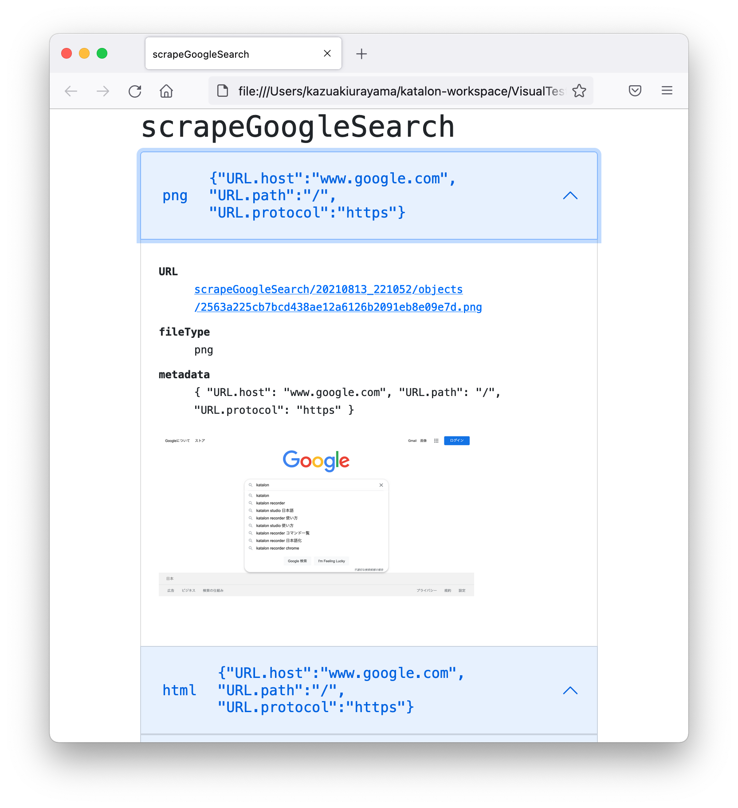
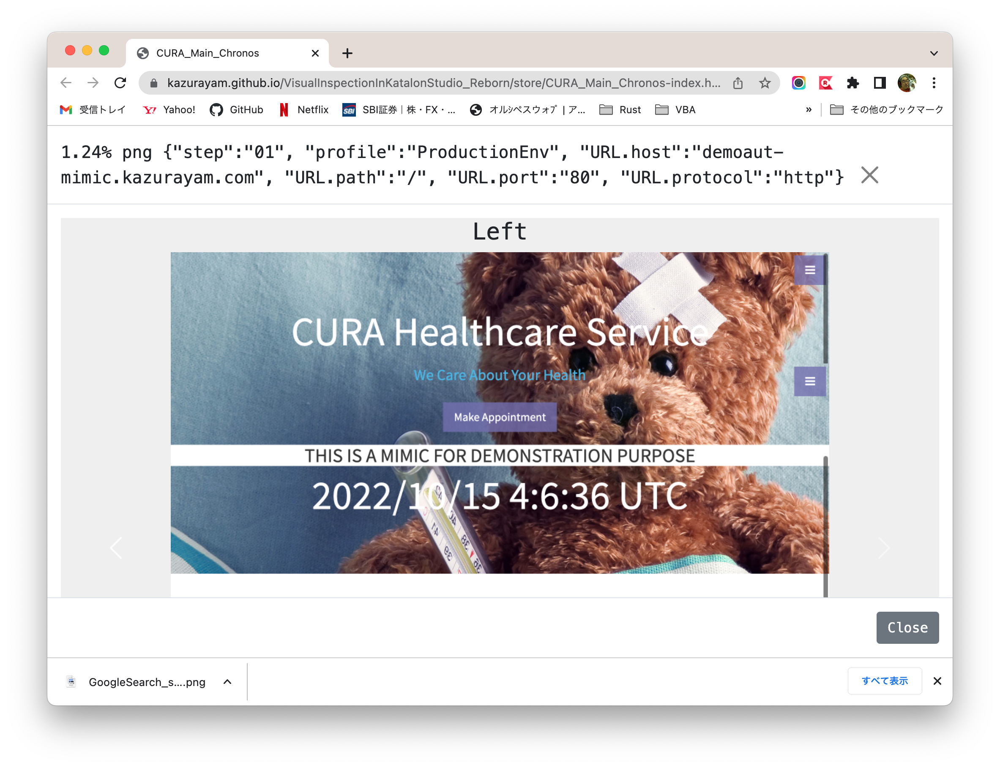
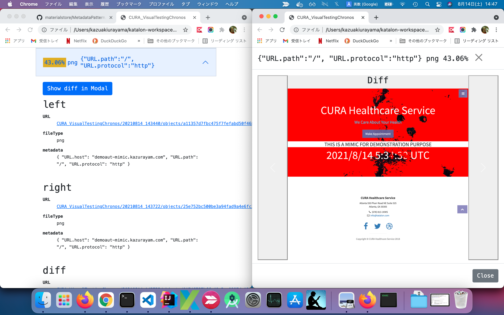
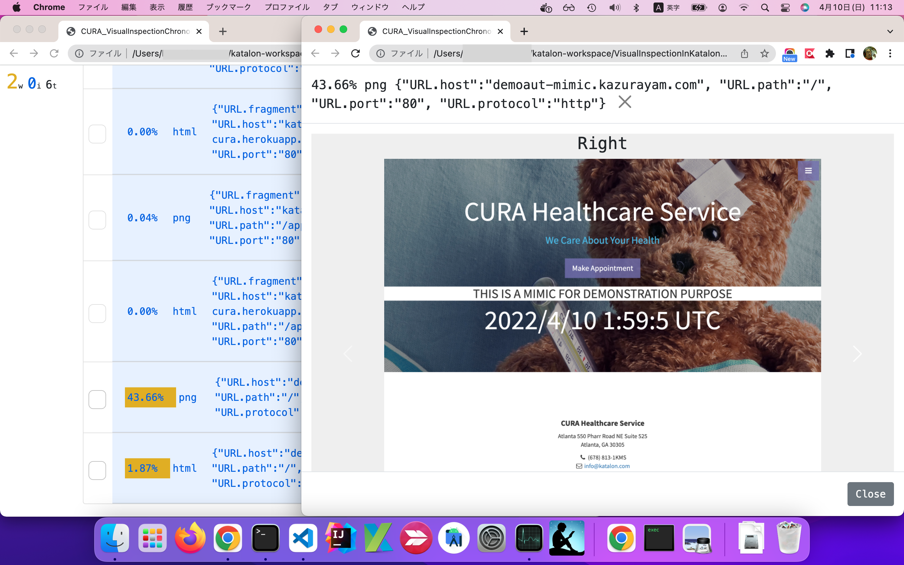
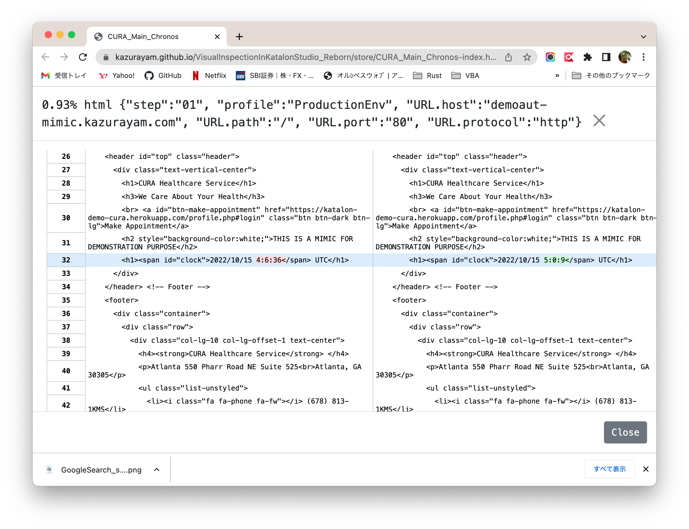
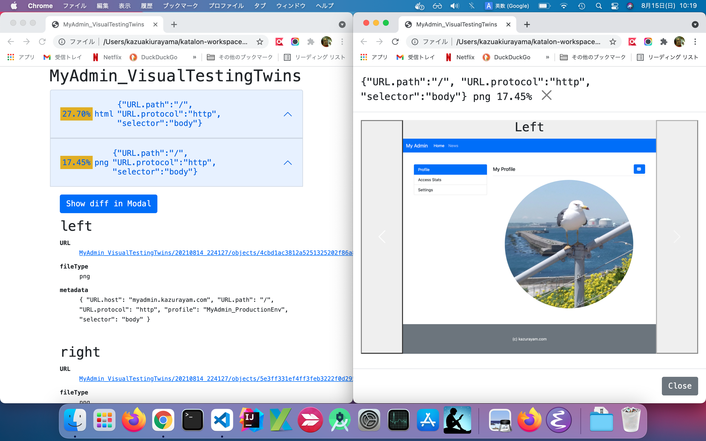
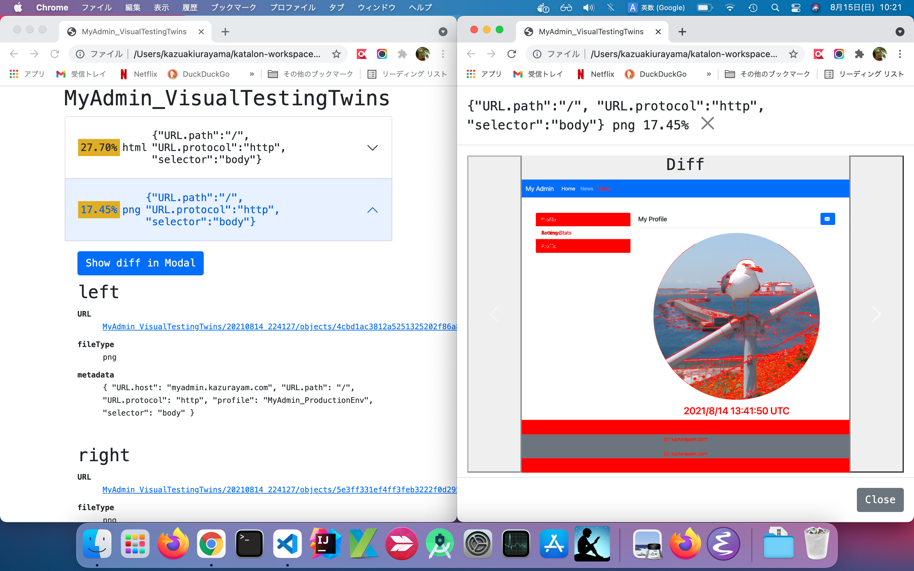
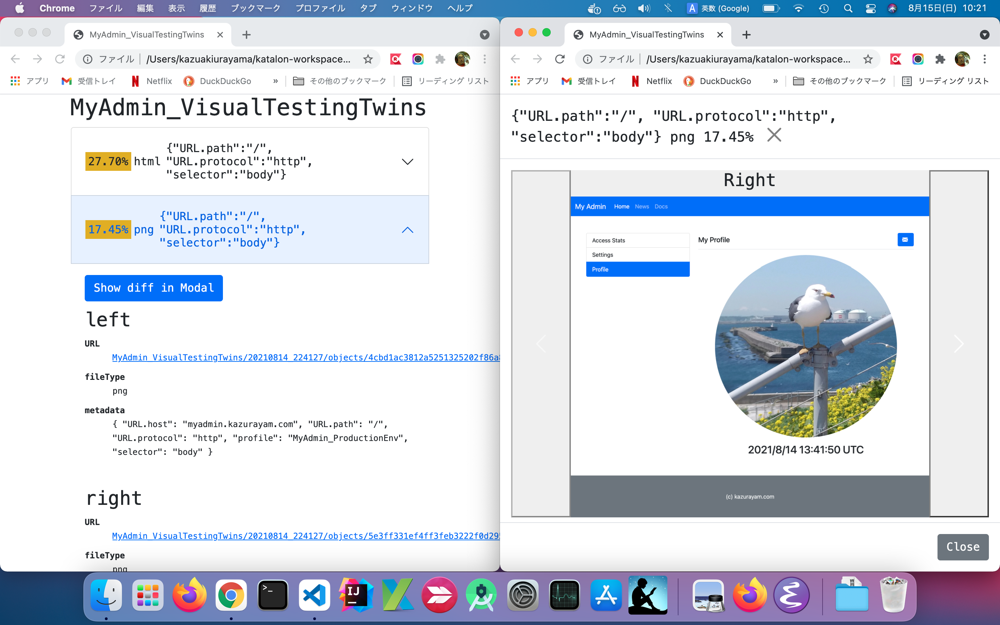
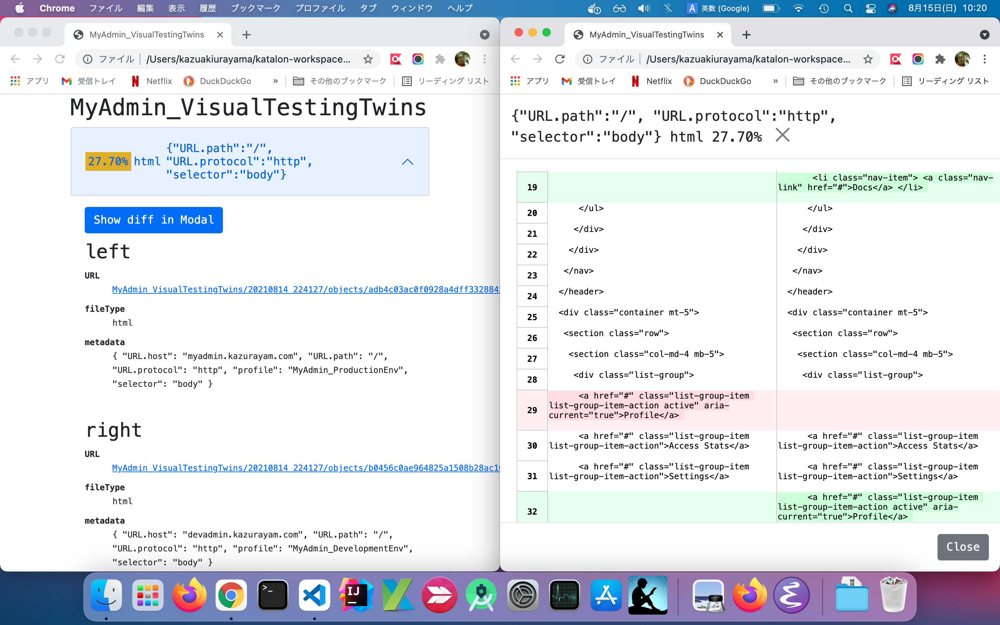

# Visual Testing in Katalon Studio Revived

- @date Aug 2021
- @author kazurayam

<!-- START doctoc generated TOC please keep comment here to allow auto update -->
<!-- DON'T EDIT THIS SECTION, INSTEAD RE-RUN doctoc TO UPDATE -->
**Table of Contents**

- [My previous work](#my-previous-work)
- [New achievement](#new-achievement)
  - [(1) Simpler codeset](#1-simpler-codeset)
  - [(2) Material Object store indexed by metadata](#2-material-object-store-indexed-by-metadata)
  - [(3) Packaged in a jar](#3-packaged-in-a-jar)
  - [(4) Usable outside Katalon Studio](#4-usable-outside-katalon-studio)
- ["materialstore" documentation](#materialstore-documentation)
- [Examples in Katalon Studio](#examples-in-katalon-studio)
  - [Creating a project, resolving external dependencies](#creating-a-project-resolving-external-dependencies)
  - [Sample1: simply visit a URL and scrape](#sample1-simply-visit-a-url-and-scrape)
    - [(1) Test Case](#1-test-case)
    - [(2) The report generated](#2-the-report-generated)
    - [(3) The "store" directory structure](#3-the-store-directory-structure)
    - [(4) The objects/ directory](#4-the-objects-directory)
    - [(5) The index file](#5-the-index-file)
    - [(6) The metadata](#6-the-metadata)
  - [Sample2: Visual Testing in Chronos mode](#sample2-visual-testing-in-chronos-mode)
    - [(1) Test Case](#1-test-case-1)
    - [(2) The "store" directory](#2-the-store-directory)
    - [(3) making Chronological diff](#3-making-chronological-diff)
    - [(4) The report generated](#4-the-report-generated)
  - [Sample3: Visual Testing in Twins mode](#sample3-visual-testing-in-twins-mode)
    - [(1) Test Case](#1-test-case-2)
    - [(2) The "store" directory](#2-the-store-directory-1)
    - [(3) makiing diffs of Twins](#3-makiing-diffs-of-twins)
    - [(4) The report generated](#4-the-report-generated-1)
- [Conclusion](#conclusion)

<!-- END doctoc generated TOC please keep comment here to allow auto update -->

## My previous work

Sep 2018, I published a project named "Visual Testing in Katalon Studio" at

- https://github.com/kazurayam/VisualTestingInKatalonStudio

Please have a look at the "Motivation" section in its README document to know why I made it. I tried to implement what I called "Visual Testing" in Katalon Studio. The project worked for me.

But I wasn't satisfied with it. Why? I would enumerate 3 problems about this project.

1. The codeset of [Visual Testing In katalon Studio](https://github.com/kazurayam/VisualTestingInKatalonStudio) project is too complicated. The project contains 28 Test Cases, 7 Test Suites, 4 Test Suite Collections, 1 Test Listener, 12 Keywords. After 3 years, I forgot them and unable to maintain them any longer.
2. The project enables me to compare a pair of 2 screenshots of Web pages in PNG image format. No more functionality is provides. More often I wanted to compare 2 texts scraped from web. E.g, 2 HTML files as Web Page source; 2 JSON files downloaded from a Web Service.
3. The project isn't packaged. It isn't distributable to others easily. It's too hard for people to reuse the codeset of the project to implement their own "Visual Testing" for their custom targets.

## New achievement

In 2021 July-August, I have developed a new project named [`materialstore`](https://github.com/kazurayam/materialstore). It is a small "object store" written in Groovy. In this project I have re-designed and re-implemented my idea from scratch. I have achieved the followings.

### (1) Simpler codeset

The `materialstore` provides a self-contained API in Groovy, which encapsulates all of the useful functionalities of the previous [Visual Testing In katalon Studio](https://github.com/kazurayam/VisualTestingInKatalonStudio) project. A single Test Case in Katalon Studio empowered by the `materialstore` library can achieve whole job equivalent to the previous one. No need to struggle with that many components (28 Test Cases + 7 Test Suites + 4 Test Suite Collections + 1 Test Listener + 12 Keywords).

### (2) Material Object store indexed by metadata

By the word "material" I mean any type of files downloaded from Web applications during automated tests. Screenshot images (PNG), Web page source (HTML), JSON and XML responded by Web Services --- I call all of these "materials".

The `materialstore` provides capability of materializing (storing) files downloaded from web sites in a pre-designed directory structure (I call it the "**store**"). It is a small "object store".

An application writes files into the *"store"* associating *"metadata"*. The *"materials"* in the "store" are indexed by the associcated *metadata*. An application retrieves files from the store by *metadata* as key. An application does not look up files by name (Path). In turn, the application is not responsible for deciding and remembering the path of materials.

 A *metadata* of a material in the store is an instance of `java.util.Map<String, String>` with arbitrary key and value pairs. You can programme any kind of *metadata* and associate it to materials so that the materials are clearly identified. For example, you can associate the URL from which the web resource was retrieved; or you can associate the name of browser ("Chrome", "FireFox", "Safari", etc) which you used to take the screenshots; or you can associate the name of "Execution Profile" you used when you executed your Test Case in Katalon Studio.

Metadata composition is entirely up to the user application. Composing metadata is a bit difficult part of the `materialstore` library. It looks similar to the database table design in SQL-backed application.

### (3) Packaged in a jar

The artifact of `materialstore` is distributed as a single jar file. The jar file is available at the [Maven Central Repository](https://mvnrepository.com/artifact/com.kazurayam/materialstore). Therefore any Java/Groovy-based application can automate downloading the `materialstore-x.x.x.jar` to resolve dependency using Gradle and Maven.

### (4) Usable outside Katalon Studio

The `materialstore`'s jar has no immediate dependency on the Katalon Studio API. It is not dependent even on the Selenium Webdriver API. So the `materialstore` library can be used in any Java/Groovy project, not only in Katalon Studio. I can use it in a plain [Selenium WebDriver](https://www.selenium.dev/documentation/webdriver/)-based automated test project for Web UI on Gradle. I can use it in a plain [Appium Java Client](https://github.com/appium/java-client)-based automated test project for Mobile UI on Maven. I can use it in a plain [Apache HttpClient](https://hc.apache.org/httpcomponents-client-5.1.x/)-based automated test project for Web Services on Ant.

## "materialstore" documentation

I would publish 2 sets of documentation with examples to describe how to use the `materialstore` library to implement "Visual Testing". The following repository contains sample codes and documentation of the `materialstore` API (yet TODO). The examples run on Gradle + Selenium WebDriver + Apache HttpClient, outside Katalon Studio.

- [materialstore-examples](https://kazurayam.github.io/materialstore-examples/)

## Examples in Katalon Studio

Here I will present 3 examples which show how to use the `materialstore` library in Kataloon Studio. I aimed 2 of 3 examples replace the previous ["Visual Testing in Katalon Studio"](https://github.com/kazurayam/VisualTestingInKatalonStudio) achievements.

### Creating a project, resolving external dependencies

You can make a new Katalon Studio project, import the required external dependencies, and write your Test Cases for "Visual Testing". Let me describe it first.

1. Install "Gradle" build tool into your PC. Please follow this [guide](https://gradle.org/install/) to install Gradle on your machine.

>You can use Gradle ver 7.0 as well as ver 6.x.

2. Open Katalon Studio GUI. Create a new project as usual in whichever directory you like.

>I will write a symbol `$projectDir` to express this project directory.

3. create `$projectDir/build.gradle`. You should copy and paste the source of:

- [build.gradle](build.gradle)

4. In the commandline you want to execute the following command:

```
$ cd $projectDir
$ gradle drivers
```

5. The `gradle driver` will display some lines of messages in 10 seconds, and will finish successfully.

```
BUILD SUCCESSFUL in 1s
1 actionable task: 1 executed
```

6. Once the command finished, in the `$projectDir/Drivers` directory, you will find some jar files are automatically imported.

```
$ tree Drivers
Drivers
├── AUTOIMPORTED_ExecutionProfilesLoader-1.2.1.jar
├── AUTOIMPORTED_ashot-1.5.4.jar
├── AUTOIMPORTED_java-diff-utils-4.9.jar
├── AUTOIMPORTED_jsoup-1.13.1.jar
├── AUTOIMPORTED_materialstore-0.1.0.jar
└── AUTOIMPORTED_subprocessj-0.1.0.jar
```

>The exact version number of the jars may change in future. Please regard this as an example.

All of these jar files are downloaded from the [Maven Central Repositry](https://mvnrepository.com/). These are required to run the "Visual Testing" code in your new project in Katalon Studio locally.

>If you are going to push this project into Git repository, you should write the `.gitignore` file so that it ignores the `Drivers/` directory.

7. You have resolved external dependencies. Now you can start writing a Test Case.

### Sample1: simply visit a URL and scrape

First example. We will write a Test Case in Katalon Studio that visits the [Google Search page](https://www.google.com/). We will take screenshots and HTML page sources of the Web page. We will store PNG files and HTML files into the `store` directory using the `materialstore` library. We will finally generate a HTML file in which we can view the stored files files.

#### (1) Test Case

You want to newly create a Test Case `Test Cases/main/GoogleSearch/scrapeGoogleSearch` in your project. Copy and paste the following sample source:

- [`Test Cases/main/GoogleSearch/searchGoogleSearch`](Scripts/main/GoogleSearch/scrapeGoogleSearch/Script1628518694544.groovy)

Once you have created the Test Case, you want to run it as usual by clicking the green button  in Katalon Studio GUI.

#### (2) The report generated

Once the Test Case finished, a HTML file will be created at `store/scrapeGoogleSearch.html`. Please open it in any web browser. It renders a view of the stored 6 files. You can see an working example here: [pls. click here](https://kazurayam.github.io/VisualTestingInKatalonStudio_revive/store/scrapeGoogleSearch.html).




#### (3) The "store" directory structure

When the Test Case finished, you will find a new directory `$projectDir/store` is created. In there you will find a tree of directories and files, like this:

```
$ tree store
store
├── scrapeGoogleSearch
│   └── 20210813_221052
│       ├── index
│       └── objects
│           ├── 01014deef318115a75ac1c3ab0f9844832c81c86.html
│           ├── 02625f7607199d99ca58b803d6fe51b7c94835e7.html
│           ├── 2563a225cb7bcd438ae12a6126b2091eb8e09e7d.png
│           ├── 5c002fbe44438341d3d92832d1e004198153976b.png
│           ├── 8370ecd0081e1fb9ce8aaecb1618ee0fc16b6924.html
│           └── efaed8443417a62faf35ee9d9b858592cd67bbae.png
└── scrapeGoogleSearch.html
```

#### (4) The objects/ directory

- Under the `store/scrapeGoogleSearch/yyyyMMdd_hhmmss/objects/` directory, there are 6 files. Among them you will find 3 files with postfix `png`. These are the screenshot of web pages in PNG image format. Also you will find 3 files with postfix `html`. These are HTML sources of web pages.

- The file name comprises with 40 hex-decimal characters appended with extension (`.png`, `.html`). The hex-decimal string (I call this "ID") is derived from the file content without compression by [SHA1 Secure Hash algorithm](https://docs.oracle.com/javase/7/docs/api/java/security/MessageDigest.html).

#### (5) The index file

- The `store/scrapeGoogleSearch/yyyyMMdd_hhmmss/index` file would be interesting. An example of the `index` file is like [this](docs/store/scrapeGoogleSearch/20210813_221052/index):

```
8370ecd0081e1fb9ce8aaecb1618ee0fc16b6924	html	{"URL.host":"www.google.com", "URL.path":"/", "URL.protocol":"https"}
2563a225cb7bcd438ae12a6126b2091eb8e09e7d	png	{"URL.host":"www.google.com", "URL.path":"/", "URL.protocol":"https"}
...
```

The `index` file is a plain text file. Each lines corresponds to each files stored in the `objects` directory.

A line of the `index` file has 3 parts delimited by TAB characters.

```
<SHA1 Hash value of each file>\t<file type>\t<metadata>
```

#### (6) The metadata

In the test Case script, the code created  *metadata* for each objects. Typically a metadata will include information derived from the URL of the source Web Page. For example, an URL

- `http://www.google.com/`

will be digested to form a metadata 

- `{"URL.host":"www.google.com", "URL.path":"/", "URL.protocol":"https"}`

Plus, you can add any key-value pair into the metadata as you like.

In the `index` file, lines are sorted by the ascending order of *metadata* text.

The `materialstore` API restricts that *metadata* texts in a `index` file MUST be unique. Your application can not create multiple objects (= multiple lines in the `index` file) with the same *metadata* value.

The `materialstore` API provides methoda for your application to retrieve files in the `objects` directory by specifying a *metadata* as key.


### Sample2: Visual Testing in Chronos mode

Second example. We will write a Test Case in Katalon Studio that visits the [http://demoaut-mimic.kazurayam.com/](http://demoaut-mimic.kazurayam.com/). The top page displays a current timestamp in the unit of seconds. So everytime you retrieve this page, the page changes slightly at the timestamp portion.

*How is the current page of a web system different from what it was previously since 5 minutes ago, 3 hours ago, or 2 days ago? I want to see the differences in HTML code, not only visually as screenshots comparison.* --- the second example will show you.

#### (1) Test Case

In your project, you want to copy&paste the following Test Case code.

- [`Test Cases/main/CURA/VisualTestingChronos`](Scripts/main/CURA/VisualTestingChronos/Script1627619550263.groovy)

You will execute the Test Case two times. You run it once; wait for some period (seconds, minuits, hours, or days, ... up to you); then run it again. The Test Case will preserve the output of previous runs.

#### (2) The "store" directory

You will get 2 directories named in the format of  `yyyyMMdd_hhmmss`. The directories will look like this:

```
$ tree store
store
├── CURA_VisualTestingChronos
│   ├── 20210814_143440
│   │   ├── index
│   │   └── objects
│   │       ├── 081a2a3e3174f13f60a9707f9464d1d73339d0e3.html
│   │       ├── 4d671f2cd14839164840a520cb185c2d1bb68586.png
│   │       ├── 504259db4e6562f62f8f70a6991fbce42aa55407.html
│   │       ├── 668b2a28455d9524fc1da35317f44d3797ea5344.html
│   │       ├── 6b82ac13ae98ca3c055d28469b75c8f377c1d8b1.png
│   │       ├── 6b8a699d921520c10b9e7e61cf62e528bf263fa8.html
│   │       ├── 8dd629a5d1b542b80bebc571c1ee35d27157ea1e.html
│   │       ├── a11357d7fbc475f7fefabd50f468b9b4fd4e8b35.png
│   │       ├── ed401b9bff2a687e41cedd9a63b3dd15880964eb.png
│   │       └── f8664dfa1c3a3af60914c4c90ddfaf0286910133.html
│   └── 20210814_143722
│       ├── index
│       └── objects
│           ├── 01746787bffa40e2ae0997da12e66c3f6ed50a87.png
│           ├── 25e752bc500be3a94fad9a4e6fc3ebc25431b558.png
│           ├── 3d56d836f5c778d0ec31f72fd74fcc5d3cb348fd.html
│           ├── 4d671f2cd14839164840a520cb185c2d1bb68586.png
│           ├── 582791931452081590447c71d8769ae185ff7cb9.html
│           ├── 668b2a28455d9524fc1da35317f44d3797ea5344.html
│           ├── 6b82ac13ae98ca3c055d28469b75c8f377c1d8b1.png
│           ├── e18882a39ba9632e9b0018e642d90a289fd1bcb7.html
│           ├── f6b51712f25ba02a5b39eedb30a57b31d455eafc.html
│           └── f8664dfa1c3a3af60914c4c90ddfaf0286910133.html
└── CURA_VisualTestingChronos-index.html
```

#### (3) making Chronological diff

The Test Case compares takes materials at chronologically different timings, and then compare the 2 sets.

[`Test Cases/CURA/VisualTestingChronos`](Scripts/main/CURA/VisualTestingChronos/Script1627619550263.groovy) does the followng processing:

1. make a List of materials in the current timestmp directory
2. make another List of materials in the previous timestamp directory
3. do take differences between the two lists
4. generate a HTML report, where you can view the detail with diff information.

#### (4) The report generated

Once the Test Case finished, a HTML file will be generated at `store/CURA_VisualTestingChronos-index.html`. Please open it in any web browser. It renders a view of the stored 6 files. You can see an working example here: [pls. click here](https://kazurayam.github.io/VisualTestingInKatalonStudio_revive/store/CURA_VisualTestingChronos-index.html).

You can see examples of screenshot comparison result: Previous screenshot - diff image - current screenshot.







Also you can see examples of HTML page sources comparison result.




### Sample3: Visual Testing in Twins mode

The 3rd example visits 2 URLs. These are useless pages solely for this example.

- [http://mydmin.kazurayam.com/](http://myadmin.kazurayam.com/)
- [http://devadmin.kazurayam.com/](http://devadmin.kazurayam.com/)

The former URL is meant to represent a *Production environment* of a web system, the latter URL is meant to represent a *Development environment*. The pages look similar at a glance, but are different in detail.

*How the pages of 2 environments differ now?* --- the 3rd example will show you.

#### (1) Test Case

In your project, you want to copy the followiing Test Case code.

- [`Test Cases/main/MyAdmin/VisualTestingTwins`](Scripts/main/MyAdmin/VisualTestingTwins/Script1627089269407.groovy)

You will execute the Test Case only once. The Test Case will visit the 2 URLs as one batch. And it creates a HTML report.

#### (2) The "store" directory

The Test Case creates a directory named in the format of `yyyyMMdd_hhmmss`. The directory looks like this:

```
$ tree store
store
├── MyAdmin_VisualTestingTwins
│   └── 20210814_224127
│       ├── index
│       └── objects
│           ├── 2cf3afe9ff4104e4055f0dc2bff53b9166e80a0c.html
│           ├── 4cbd1ac3812a5251325202f86a8dfe76bc82dbdc.png
│           ├── 5e3ff331ef4ff3feb3222f0d2951aed284e47ac2.png
│           ├── adb4c03ac0f0928a4dff3328845c4db460fc72b5.html
│           ├── b0456c0ae964825a1508b28ac1042340b29c9357.html
│           └── e911ce587553fc42f24bf18279ee3f5214eb75ba.png
└── MyAdmin_VisualTestingTwins-index.html
```


#### (3) makiing diffs of Twins

The Test Case looks up 2 set of materials and compare them.

The [`Test Cases/main/MyAdmin/VisualTestingTwins`](Scripts/main/MyAdmin/VisualTestingTwins/Script1627089269407.groovy) does the following processing:

1. Amongst the stored materials, select 2 (a screenshot and a HTML) of the *Development environment* to make a List.
2. Also select 2 of the *Projection environment* to make a Liist.
3. do take differences between the two lists. 
4. will insert files into the "store", which contains the diff information.
5. generate a HTML report, where you can view the detail with diff information.

----

How can I select 2 sets of materials to compare? How can I find pairs of materials to compaire? What is the rule of lookup?

Well, it is a bit difficult to explain. ... I wonder if I could describe it in English, but let me try ...

In the `objects` directory, there are 6 files. These are a mixture of materials downloaded from 2 URLs. How can I tell which file is from which URL? --- The `index` file keeps enough information. The content of `index` file is as follows:

- [store/MyAdmin_VisualTestingTwins/20210814_224127/index](docs/store/MyAdmin_VisualTestingTwins/20210814_224127/index)

In there you can find the following 2 lines. These lines point to the PNG screenshots of the 2 environments. I call the 3 column delimited by \t (`{"URL.host": ... :"body"}`) as *metadata*.

```
...
5e3ff331ef4ff3feb3222f0d2951aed284e47ac2	png	{"URL.host":"devadmin.kazurayam.com", "URL.path":"/", "URL.protocol":"http", "profile":"MyAdmin_DevelopmentEnv", "selector":"body"}
...
4cbd1ac3812a5251325202f86a8dfe76bc82dbdc	png	{"URL.host":"myadmin.kazurayam.com", "URL.path":"/", "URL.protocol":"http", "profile":"MyAdmin_ProductionEnv", "selector":"body"}
...
```

These 2 lines have a common portion in the *metadata*:

```
{"URL.path":"/", "selector":"body"}
```

Also they have a different portion:

```
{{"URL.host":"devadmin.kazurayam.com", "profile":"MyAdmin_DevelopmentEnv"}
{{"URL.host":"myadmin.kazurayam.com", "profile":"MyAdmin_ProductionEnv"}
```

The Test Case script can select 2 lines as a pair amongst others by looking at their *metadata*. You want to ignore the known different portions in the *metadata*, then the pairs will be identified by the common portions.

Difficult to understand? --- Well, I agree. But this is the best (flexible, expressive) method I could develop.


#### (4) The report generated

Once the Test Case finished, a HTML fill weill be generated at `store/MyAdmin_VisualTestingTwins-index.html`. Please open it in any web browser. It renders a view of the stored 1 page, both in PNG screenshot and HTML page source. You can see an working example here: [pls.click here](https://kazurayam.github.io/VisualTestingInKatalonStudio_revive/store/MyAdmin_VisualTestingTwins-index.html)

You can see a screenshot comparison result: Production Env - Diff - Development Env.







Also you can see the diff of HTML page source.




## Conclusion

The [Visual Testing In Katalon Studio](https://github.com/kazurayam/VisualTestingInKatalonStudio) project is now superceded by this [Visual Testing In Katalon Studio Revived](https://github.com/kazurayam/VisualTestingInKatalonStudio_revive) project backed by the [materialstore](https://github.com/kazurayam/materialstore) library.
