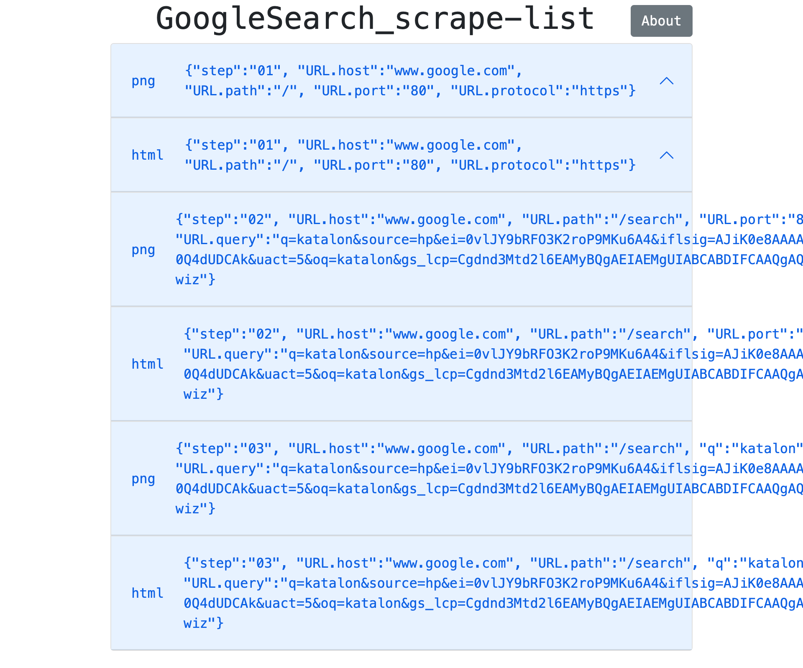
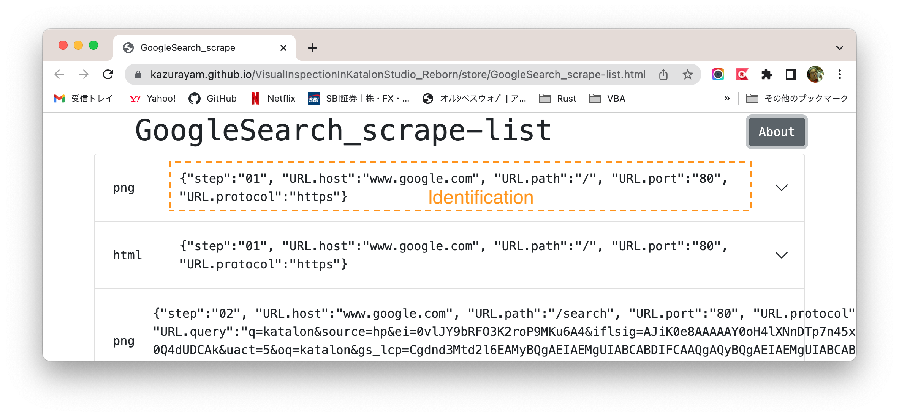

<!-- START doctoc generated TOC please keep comment here to allow auto update -->
<!-- DON'T EDIT THIS SECTION, INSTEAD RE-RUN doctoc TO UPDATE -->
**Table of Contents**

- [Visual Inspection in Katalon Studio - Reborn](#visual-inspection-in-katalon-studio---reborn)
  - [My previous work](#my-previous-work)
  - [My new development](#my-new-development)
    - [(1) Simpler code set](#1-simpler-code-set)
    - [(2) Domain-specific file system indexed by metadata](#2-domain-specific-file-system-indexed-by-metadata)
    - [(3) Packaged in a jar](#3-packaged-in-a-jar)
    - [(4) Usable outside Katalon Studio](#4-usable-outside-katalon-studio)
  - [Examples in Katalon Studio](#examples-in-katalon-studio)
    - [Creating a project, resolving external dependencies](#creating-a-project-resolving-external-dependencies)
    - [Demo outputs](#demo-outputs)
  - [Sample1: simply visit a web site to take screenshots](#sample1-simply-visit-a-web-site-to-take-screenshots)
      - [(1) Test Case](#1-test-case)
      - [(2) The report generated](#2-the-report-generated)
      - [(3) The "store" directory structure](#3-the-store-directory-structure)
      - [(4) The objects/ directory](#4-the-objects-directory)
      - [(5) The index file](#5-the-index-file)
      - [(6) The metadata](#6-the-metadata)
      - [(7) How to sort the entries in the report](#7-how-to-sort-the-entries-in-the-report)
  - [Sample2: Visual Inspection in Chronos mode](#sample2-visual-inspection-in-chronos-mode)
      - [(1) Test Case](#1-test-case-1)
      - [(2) Execution Profile](#2-execution-profile)
      - [(3) The "store" directory](#3-the-store-directory)
      - [(4) making Chronological diff](#4-making-chronological-diff)
      - [(5) The report generated](#5-the-report-generated)
      - [(6) Interactively memorizing ignorable diffs](#6-interactively-memorizing-ignorable-diffs)
  - [Sample3: Visual Inspection in Twins mode](#sample3-visual-inspection-in-twins-mode)
      - [(1) Test Case](#1-test-case-2)
      - [(2) Execution Profile](#2-execution-profile-1)
      - [(3) The "store" directory](#3-the-store-directory-1)
      - [(4) making diffs of Twins](#4-making-diffs-of-twins)
        - [Selection algorithm](#selection-algorithm)
      - [(5) The report generated](#5-the-report-generated-1)
  - [Notes on Extensibility](#notes-on-extensibility)
    - [for Mobile](#for-mobile)
    - [for Web Service](#for-web-service)
  - [Conclusion](#conclusion)

<!-- END doctoc generated TOC please keep comment here to allow auto update -->

# Visual Inspection in Katalon Studio - Reborn

- @date Aug 2021
- @update 15 Oct 2022, ver 0.10.3
- @author kazurayam


## My previous work

Sep 2018, I published a project named "Visual Testing in Katalon Studio" at

- https://github.com/kazurayam/VisualTestingInKatalonStudio

Please have a look at the "Motivation" section in its README document to know why I made it. I tried to implement what I called "Visual Testing" in Katalon Studio. That project worked for me.

But I wasn't satisfied with it. Why? I would enumerate 3 problems about that project.

1. The code set of [Visual Testing In katalon Studio](https://github.com/kazurayam/VisualTestingInKatalonStudio) project is too complicated. The project contains 28 Test Cases, 7 Test Suites, 4 Test Suite Collections, 1 Test Listener, 12 Keywords. After 3 years, I forgot them and unable to maintain them any longer.
2. The project enabled me to compare a pair of 2 screenshots of Web pages in PNG image format. I found that it is not enough. Often I wanted to compare 2 texts scraped from web. For example, I wanted to compare 2 HTML files. Also I wanted to compare 2 JSON files downloaded from a Web Service.
3. The project wasn't distributable to others easily because it wasn't packaged as "jar". It was too hard for people to reuse the code set of the project to achieve their own "Visual Testing" for their custom targets.

## My new development

In 2021 July-August, I have developed a new project named [`materialstore`](https://github.com/kazurayam/materialstore). It is a domain-specific file system written in Groovy, accompanied with a set of utility class that implements "Visual Testing". In this project I have re-designed and re-implemented my idea from scratch. In the materialstore library, I have achieved the followings.

### (1) Simpler code set

The `materialstore` provides a self-contained API in Java8, which encapsulates all of the useful functionalities of the previous [Visual Testing In katalon Studio](https://github.com/kazurayam/VisualTestingInKatalonStudio) project. A single Test Case in Katalon Studio empowered by the `materialstore` library can achieve whole job equivalent to the previous one. No need to struggle with that many components (28 Test Cases + 7 Test Suites + 4 Test Suite Collections + 1 Test Listener + 12 Keywords).

### (2) Domain-specific file system indexed by metadata

By the word *material* I mean any type of files downloaded from Web applications during automated tests. Screenshot images (PNG), Web page source (HTML), JSON and XML responded by Web Services --- I call all of these as *materials*.

The `materialstore` provides capability of materializing (storing) files downloaded from web sites in a pre-designed directory structure (I call it the *store*).

An application writes files into the *"store"* associating *"metadata"*. The *"materials"* in the "store" are indexed by the associated *metadata*. An application retrieves files from the store by querying for *metadata*. An application does not look up files by physical name. The application is no longer responsible for deciding and remembering the path of physical files.

A *metadata* of a material in the store is merely an instance of `java.util.Map<String, String>` with arbitrary key=value pairs. You can programme any kind of *metadata* and associate it to each materials so that the materials are well described.

For example, you can associate the URL from which the web resource was retrieved; or you can associate the name of browser ("Chrome", "FireFox", "Safari", etc) which you used to take the screenshots; or you can associate the name of "Execution Profile" in Katalon Studio which you applied when you executed your Test Case.

And you are responsible for creating metadata that clearly and uniquely identifies a material amongst a set of materials created a single run of test.

Metadata composition is entirely up to the user application. Composing metadata is difficult part of the `materialstore` library. It looks similar to designing database table in SQL-backed application.


### (3) Packaged in a jar

The artifact of `materialstore` is distributed as a single jar file. The jar file is available at the [Maven Central Repository](https://mvnrepository.com/artifact/com.kazurayam/materialstore). Any Java/Groovy-based application can automate downloading the `materialstore-x.x.x.jar` to resolve the dependency using the build tools (Gradle, Maven, Ant).

### (4) Usable outside Katalon Studio

The `materialstore` library is a set of Plain Old Java Objects, which has no immediate dependency on the Katalon Studio API. It has no dependency on the Selenium WebDriver API either.

So the `materialstore` library can be used in any Java/Groovy project outside Katalon Studio. I can use it in a plain [Selenium WebDriver](https://www.selenium.dev/documentation/webdriver/)-based automated test project for Web UI on Gradle. I can use it in a plain [Appium Java Client](https://github.com/appium/java-client)-based automated test project for Mobile UI on Maven. I can use it in a plain [Apache HttpClient](https://hc.apache.org/httpcomponents-client-5.1.x/)-based automated test project for Web Services on Ant.

This "VisualTestingInKatalonStudio_Reborn" project is a mere demonstration how to utilize the `materialstore` library in Katalon Studio.

## Examples in Katalon Studio

### Creating a project, resolving external dependencies

You can create a new Katalon Studio project, import the required external dependencies, and write your Test Cases for "Visual Inspection". Let me describe the procedure how to create your "Visual Inspection Reborn" project.

1. Install "Gradle" build tool into your PC. Please follow this [guide](https://gradle.org/install/) to install Gradle on your machine.

>You can use Gradle ver 7.x as well as ver 6.x.

2. Open Katalon Studio GUI. Create a new project as usual in whichever directory you like.

>I will write a symbol `$projectDir` to express this project directory.

3. create `$projectDir/build.gradle`. You should copy and paste the source of:

- [build.gradle](build.gradle)

4. In the commandline (outside Katalon Studio GUI) you want to execute the following command:

```
$ cd $projectDir
$ gradle drivers
```

5. The `gradle driver` will display some lines of messages in 10 seconds, and will finish successfully.

```
BUILD SUCCESSFUL in 1s
1 actionable task: 1 executed
```

6. Once the command finished, in the `$projectDir/Drivers` directory, you will find some jar files are automatically imported.

```
$ tree Drivers

Drivers
├── AUTOIMPORTED_ExecutionProfilesLoader-1.2.1.jar
├── AUTOIMPORTED_ashot-1.5.4.jar
├── AUTOIMPORTED_freemarker-2.3.31.jar
├── AUTOIMPORTED_java-diff-utils-4.11.jar
├── AUTOIMPORTED_jsoup-1.14.3.jar
├── AUTOIMPORTED_materialstore-0.10.3-SNAPSHOT.jar
```

>The exact version number of the jars may change in future. Please regard this as an example.

All of these jar files are downloaded from the [Maven Central Repository](https://mvnrepository.com/).

>If you are going to push your new project into Git repository, you should write the `.gitignore` file so that it ignores the `Drivers/` directory.

7. Stop Katalon Studio, restart it and re-open the project.

You have resolved external dependencies. Now you can start writing a Test Case.

### Demo outputs

- https://kazurayam.github.io/VisualInspectionInKatalonStudio_Reborn/


## Sample1: simply visit a web site to take screenshots

First example. We will write a Test Case in Katalon Studio that visits the [Google Search page](https://www.google.com/). We will take screenshots and HTML page sources of the Web page. We will store PNG files and HTML files into the `store` directory using the `materialstore` library. We will finally generate a HTML file in which we can view the stored PNG and HTML files.

#### (1) Test Case

You want to newly create a Test Case `Test Cases/main/GoogleSearch/scrapeGoogleSearch` in your project. Copy and paste the following sample source:

- [`Test Cases/main/GoogleSearch/searchGoogleSearch`](https://github.com/kazurayam/VisualInspectionInKatalonStudio_Reborn/blob/master/Scripts/main/GoogleSearch/Main/Script1646909950671.groovy)

You want to run it by clicking the green button  in Katalon Studio GUI.

#### (2) The report generated

Once the Test Case finished, a HTML file will be created at `store/scrapeGoogleSearch.html`. Please open it in any web browser. It renders a view of the stored 6 files. You can see an working example here: [pls. click here](https://kazurayam.github.io/VisualInspectionInKatalonStudio_Reborn/store/GoogleSearch_scrape-list.html).




#### (3) The "store" directory structure

When the Test Case finished, you will find a new directory `$projectDir/store` is created. In there you will find a tree of directories and files, like this:

```
$ tree store
store
...
├── GoogleSearch_scrape
│   └── 20221016_084617
│       ├── index
│       └── objects
│           ├── 09be6ef6ef37f04bf34977fcce96088195a0cd76.html
│           ├── 1ae20a4dc1fce5fdec3ee457b1af1106e632880b.png
│           ├── 63cc4d50d6140aa3db07ed1da6477f528ede9fa6.png
│           ├── 7203b58eba10f9b7d9220532b72990f0732ce673.png
│           └── d331434cb6bfed9772c54727bdaaed4ac3fdeefa.html
├── GoogleSearch_scrape-list.html
...
17 directories, 39 files
```

#### (4) The objects/ directory

- Under the `store/GoogleSearch_scrape/yyyyMMdd_hhmmss/objects/` directory, there are 5 files. Among them you will find 3 files with postfix `png`. These are the screenshot of web pages in PNG image format. Also you will find 2 files with postfix `html`. These are HTML sources of web pages.

- The file name comprises with 40 hex-decimal characters appended with extension (`.png`, `.html`). The hex-decimal string (I call this "ID") is derived from the file content without compression by [SHA1 Secure Hash algorithm](https://docs.oracle.com/javase/7/docs/api/java/security/MessageDigest.html).

#### (5) The index file

- The `store/GoogleSearch_scrape/yyyyMMdd_hhmmss/index` file would be interesting. An example of the `index` file is like [this](docs/store/GoogleSearch_/20221016_084617/index):

```
09be6ef6ef37f04bf34977fcce96088195a0cd76	html	{"q":"katalon", "step":"03", "URL.host":"www.google.com", "URL.path":"/search", "URL.port":"80", "URL.protocol":"https", "URL.query":"q=katalon"}
7203b58eba10f9b7d9220532b72990f0732ce673	png	{"q":"katalon", "step":"03", "URL.host":"www.google.com", "URL.path":"/search", "URL.port":"80", "URL.protocol":"https", "URL.query":"q=katalon"}
d331434cb6bfed9772c54727bdaaed4ac3fdeefa	html	{"step":"01", "URL.host":"www.google.com", "URL.path":"/", "URL.port":"80", "URL.protocol":"https"}
63cc4d50d6140aa3db07ed1da6477f528ede9fa6	png	{"step":"01", "URL.host":"www.google.com", "URL.path":"/", "URL.port":"80", "URL.protocol":"https"}
09be6ef6ef37f04bf34977fcce96088195a0cd76	html	{"step":"02", "URL.host":"www.google.com", "URL.path":"/search", "URL.port":"80", "URL.protocol":"https", "URL.query":"q=katalon"}
1ae20a4dc1fce5fdec3ee457b1af1106e632880b	png	{"step":"02", "URL.host":"www.google.com", "URL.path":"/search", "URL.port":"80", "URL.protocol":"https", "URL.query":"q=katalon"}
```

The `index` file is a plain text file. Each lines corresponds to each files stored in the `objects` directory.

A line of the `index` file has 3 parts delimited by TAB characters.

```
<SHA1 Hash value of each file>\t<file type>\t<metadata>
```

#### (6) The metadata

In the test Case script, the code created  *metadata* for each objects. Typically a metadata will include information derived from the URL of the source Web Page. For example, an URL

- `http://www.google.com/`

will be digested to form a metadata

- `{"URL.host":"www.google.com", "URL.path":"/", "URL.port":"80", "URL.protocol":"https"}`

You can add any key-value pair into the metadata as you like. For example, you would want to add some sequential numbering like `"step":"01"`, `"step":"02"` and `"step":"03"`. This will enable to sort the entities in the file report sorted in the order you like.

In the `index` file, lines are sorted by the ascending order of *metadata* text.

The `materialstore` API restricts that *metadata* texts in a `index` file MUST be unique. Your application can not create multiple objects (= multiple lines in the `index` file) with the same *metadata* value.

#### (7) How to sort the entries in the report

In the report, the entries are sorted by the ascending order of the "Identification" string. The "Identification" is the portion highlighted in the following image:



If you want to sort multiple screenshots in the order as they were taken, then you would want to do two things:

1. while your script takes screenshots, you want to add an Metadata attribute that represents the sequence. For example, add `"step":"01"`, `"step":"02"` and `"step":"03"`. See the Line#46 of [Test Cases/main/GoogleSearch/materialize](https://github.com/kazurayam/VisualInspectionInKatalonStudio_Reborn/blob/master/Scripts/main/GoogleSearch/materialize/Script1646277768963.groovy)
```
Metadata metadata1 = Metadata.builder(searchPageURL).put("step", "01").build()
```
2. when your script generates a report, specify attribute names as SortKeys. The attribute specified as SortKeys will come left-most of each Identification string, so that will have higher priority of sorting order. See the Line#25 of [Test Cases/main/GoogleSearch/report](https://github.com/kazurayam/VisualInspectionInKatalonStudio_Reborn/blob/master/Scripts/main/GoogleSearch/report/Script1646277780839.groovy)
```
Inspector inspector = Inspector.newInstance(store)
SortKeys sortKeys = new SortKeys("step","URL.host", "URL.path")
inspector.setSortKeys(sortKeys)
Path report = inspector.report(materialList, fileName)
```

## Sample2: Visual Inspection in Chronos mode

Second example. We will write a Test Case in Katalon Studio that visits the [http://demoaut-mimic.kazurayam.com/](http://demoaut-mimic.kazurayam.com/). The top page displays a current timestamp in the unit of seconds. So everytime you retrieve this page, the page changes slightly at the timestamp portion.

*How is the current page of a web system different from what it was previously since 5 minutes ago, 3 hours ago, or 2 days ago? I want to see the differences in HTML code, not only visually as screenshots comparison.* --- the second example will show you how to implement a test that helps.

#### (1) Test Case

In your project, you want to copy&paste the following Test Case code.

- [`Test Cases/main/CURA/VisualInspectionChronos`](
  https://github.com/kazurayam/VisualInspectionInKatalonStudio_Reborn/blob/master/Scripts/main/CURA/Main_Chronos/Script1646219948928.groovy)

You will execute the Test Case two times. You run it once; wait for some period (seconds, minutes, hours, or days, ... up to you); then run it again. The Test Case will preserve the output of previous runs.

#### (2) Execution Profile

This Test Case expects an Execution Profile is provided like this:

- `Profiles/CURA_DevelopmentEnv`


Please create it in your project.


#### (3) The "store" directory

You will get 2 directories named in the format of  `yyyyMMdd_hhmmss`. The directories will look like this:

```
$ tree store
store
├── CURA_Main_Chronos
│   ├── 20221016_084722
│   │   ├── index
│   │   └── objects
│   │       ├── 3e7cfb9128556d0f5bca16af1c7be00396f15d8b.png
│   │       ├── 46bd12e0dbfeb39bbbbc67c1996395b0ea666c20.png
│   │       ├── 61ed7eeb5d1bc3388808e4f747537a599768acc6.html
│   │       ├── 919580be9a8fb2e195ffe40bfe687caf4718d312.html
│   │       ├── d85de77a8e6df464d89a3d8501e243f53ac527c3.png
│   │       └── f3de4cfcf448606fa7b15250d88f792dacb62e6c.html
│   ├── 20221016_084759
│   │   ├── index
│   │   └── objects
│   │       ├── 5ce9b37a8632a97a7355fb3a09014a7105854927.png
│   │       ├── 9835d49d33407bfe0cd7f9ef41e69c151a4ee3d3.html
│   │       ├── a3e78a6b3ed0005dcef5f8419da3ce7f0d151f13.png
│   │       ├── d85de77a8e6df464d89a3d8501e243f53ac527c3.png
│   │       ├── d9e7abf1d048e4f0e512a0f499db98dd01e4620a.html
│   │       └── e62bda5328f450387273668749cc7ca525988da5.html
│   └── 20221016_084824
│       ├── index
│       └── objects
│           ├── 06bf1cdb8d3778092dcc488403a909463bd8c987.html
│           ├── 15a6cdaad19f4c2f22b4722f33717d625f33a550.html
│           ├── 1e865231bdc6a6cc6570d05a82f17e429995e049.png
│           ├── 2af8aef025af08139ab96dbc71378279c775af6d.png
│           ├── b716d42df3912f11c350edcad74221b90bd41e83.html
│           └── d85de77a8e6df464d89a3d8501e243f53ac527c3.png
├── CURA_Main_Chronos-index.html
...
```

#### (4) making Chronological diff

The Test Case compares takes materials at chronologically different timings, and then compare the 2 sets.

`Test Cases/CURA/VisualInspectionChronos` does the following processing:

1. make a List of materials in the current timestamp directory
2. make another List of materials in the previous timestamp directory
3. make differences between the two lists, store the diff info into the store as well
4. generate a HTML report, where you can view the detail with diff information.

#### (5) The report generated

Once the Test Case finished, a HTML file will be generated at `store/CURA_VisualInspectionChronos-index.html`. Please open it in any web browser. It renders a view of the stored 6 files. You can see an working example here: [pls. click here](https://kazurayam.github.io/VisualInspectionInKatalonStudio_Reborn/store/CURA_Main_Chronos-index.html).

You can see examples of screenshot comparison result: Previous screenshot - diff image - current screenshot.


Also you can see examples of HTML page sources comparison result.


#### (6) Interactively memorizing ignorable diffs

You can interact with the report generated by the Visual Inspection. See the top-left corner of the report. You will find the count of "diff" entities are displayed.


- `2w 0i 6t`

This means:

- There are 2 diff entities as **W**arnings that have a diff-ratio greater than the criteria given.
- There are 0 diff entities as **I**gnored that have a diff-ratio greater than the criteria given, and is "checked to be ignorable"
- There are 6 diff entities in **T**otal.

In this sample case, I created 6 materials (PNG screenshot and HTML source saved). I set `1.0%` as the criteria of evaluating the diffRatio; if an entity has a diffRatio greater than 1.0, it will be marked *warning*, hence the figure `46.66%` is highlighted with the background color of yellow.

A large diffRatio indicates to me that there must be some reason that caused significant visual differences; therefore I should look into the system. Definitely I will do for every entities warned. I would find some reason why the diffRatio is as large as `46.66%`. No matter what the reason is, I would decide whether the entity is **ignorable** or not.

In fact in most cases, the diffs detected by automated tests are ignorable for human. For example, when I compare a development environment against a production environment of a Web app, it is quite likely that there are some significant visual differences caused by the recent changes in the application software in the development environment. Any visual differences caused by known factors are **ignorable** for human, and I want to differentiate them from the diffs caused by unexpected factors.

Only human can decide if a visual difference is ignorable or not; my Visual Inspection tool does not decide it. But *the tool offers you a feature of persisting your decision into the report and memorize it across sessions.* Let me assume I have found out that the entity with 46.33% in the following screenshot is ignorable. Then I would interact with the report displayed in a browser. I will click the checkbox at the left end of the entity.


When the checkbox is checked, the diffRatio `43.66%` changes its background color less highlighted. And the "Count" display on the top-left corner changes:

- `2w 0i 6t` => `1w 1i 6t`

This display indicates that I have 1 warning, 1 ignorable, among 6 entities in total.

I will continue debugging. I will look at the entity with the diffRatio `1.87%`. Let me assume I found it *ignorable* again. Then I will check it also. Eventually the report would give the following display:


Now I have got

- `0w 2i 6t`

*I have zero warnings! Congrat! I have finished inspecting this web application!*

The status checkbox toggled ON/OFF by human is persisted into [localStorage](https://developer.mozilla.org/en-US/docs/Web/API/Window/localStorage) of browser. Therefore your decisions (which entities to be ignored) will be retained across browser sessions. You can reload the report, close and reopen the report. The checkboxes in the report will keep the status you put previously.

`2w 0i 6t` => `1w 1i 6t` => `0w 2i 6t` --- I would name this display as WIT --- makes my inspection task spirally upward. It helps me gradually improve the target system through executing Visual Inspection repeatedly.

## Sample3: Visual Inspection in Twins mode

The 3rd example visits 2 URLs at almost the same timing.

- [http://mydmin.kazurayam.com/](http://myadmin.kazurayam.com/)
- [http://devadmin.kazurayam.com/](http://devadmin.kazurayam.com/)

The former URL is meant to represent a *Production environment* of a web system, the latter URL is meant to represent a *Development environment*. The pages look similar at a glance, but in fact these are different in detail.

*How the pages of 2 environments differ now?* --- the 3rd example will show you.

#### (1) Test Case

In your project, you want to copy the following Test Case code.

- [`Test Cases/main/MyAdmin/VisualInspectionTwins`](https://github.com/kazurayam/VisualInspectionInKatalonStudio_Reborn/blob/master/Scripts/main/MyAdmin/Main_Twins/Script1646272006678.groovy)

You will execute the Test Case only once. The Test Case will visit the 2 URLs as one batch. And it creates a HTML report.

#### (2) Execution Profile

The Test Case script expects 2 Execution Profiles are provided like this:

- `Profiles/MyAdmin_DevelopmentEnv`


- `Profiles/MyAdmin_ProductionEnv`


Please create them in your project.

#### (3) The "store" directory

Once finished, the Test Case creates a directory named in the format of `yyyyMMdd_hhmmss`. The directory looks like this:

```
$ tree store
store
...
├── MyAdmin_Main_Twins
│   ├── 20221016_084837
│   │   ├── index
│   │   └── objects
│   │       ├── 1f2f0176d802db36521219ce281432dc0e67d920.png
│   │       └── 4419c44062177d8cb12a839169bc63b53cba003b.html
│   ├── 20221016_084846
│   │   ├── index
│   │   └── objects
│   │       ├── b59bdac875b80dc47fe3345b4dbe8968db48188d.png
│   │       └── b95fe452b63a6a9b5d5c4329ffaab6945e414943.html
│   └── 20221016_084853
│       ├── index
│       └── objects
│           ├── 5c75382c591698c749db0e03850135ddc72310fb.html
│           └── 843303409b05d859e8af8617c347fe19f88290f3.png
└── MyAdmin_Main_Twins-index.html

```


#### (4) making diffs of Twins

The Test Case looks up 2 sets of materials and compare them.

`Test Cases/main/MyAdmin/VisualInspectionTwins` does the following processing:

1. Amongst the stored materials, select 2 (a screenshot and a HTML) of the *Development environment* to make a List.
2. Also select 2 of the *Production environment* to make a List.
3. compare the two Lists and find differences between them.
4. will insert files into the "store", which contains the diff information.
5. generate a HTML report, where you can view the detail with diff information.

##### Selection algorithm

How can I select 2 materials to compare out of the set of many materials?

*Well, it is very difficult to explain. Possibly the current design is not as good as it should be. I wonder if I could describe it in English, but let me try.*

The following file records the metadata of files taken out of the "Production environment":

`store/MyAdmin_Main_Twins/20221016_084837/index` :

```
4419c44062177d8cb12a839169bc63b53cba003b	html	{"profile":"MyAdmin_ProductionEnv", "URL.host":"myadmin.kazurayam.com", "URL.path":"/", "URL.port":"80", "URL.protocol":"http"}
1f2f0176d802db36521219ce281432dc0e67d920	png	{"profile":"MyAdmin_ProductionEnv", "URL.host":"myadmin.kazurayam.com", "URL.path":"/", "URL.port":"80", "URL.protocol":"http"}
```

Another file records the metadata of files taken out of the "Development environment":

`store/MyAdmin_Main_Twins/20221016_084837/index` :

```
b95fe452b63a6a9b5d5c4329ffaab6945e414943	html	{"profile":"MyAdmin_DevelopmentEnv", "URL.host":"devadmin.kazurayam.com", "URL.path":"/", "URL.port":"80", "URL.protocol":"http"}
b59bdac875b80dc47fe3345b4dbe8968db48188d	png	{"profile":"MyAdmin_DevelopmentEnv", "URL.host":"devadmin.kazurayam.com", "URL.path":"/", "URL.port":"80", "URL.protocol":"http"}
```

If you look at these 2 files carefully, you can identify 2 pairs of lines by common portion in the *metadata*.

One pair can be identified by:

```
html { ... "URL.path":"/" ... }
```

Another pair can be identified by:

```
png { ... "URL.path":"/" ... }
```

Here we will abstract several attributes with different values: `"URL.host"` and `"profile"`.

The Test Case script can select 2 lines as a pair amongst others by looking at their *metadata*. I would ignore the known different portions in the *metadata* resulting a common portion. Taking the common portion as a key of lookup, I could find a pair or materials to compare.

Difficult to understand? Well, I agree. But this is the best flexible and expressive method I could develop.

#### (5) The report generated

Finally the Test Case will generate a HTML report of which path is `store/MyAdmin_VisualInspectionTwins-index.html`. Please open it in any web browser. It renders a view of the stored 1 page, both in PNG screenshot and HTML page source. You can see an working example here: [pls.click here](https://kazurayam.github.io/VisualInspectionInKatalonStudio_Reborn/store/MyAdmin_VisualInspectionTwins-index.html)

You can see a screenshot comparison result: Production Env - Diff - Development Env.


Also you can see the diff of HTML page source.


## Notes on Extensibility

The `materialstore` library is usable for various cases. Once the materials are saved into the store, same diff + reporting features work.

### for Mobile

The `materialstore` library can be used by a [Appium](https://appium.io/)-based Mobile testing in Java. All you need to do is to take screenshots of Mobile app using Katalon Studio's built-in keyword (e.g, [Mobile taksScreenshot](https://docs.katalon.com/katalon-studio/docs/mobile-take-screenshot.html)) and save the image into the `store`.

### for Web Service

The `materialstore` library can be used by a [Apache HttpClient](https://hc.apache.org/httpcomponents-client-5.1.x/)-based Web Service testing in Java. Using Katalon Studio's [sendRequest](https://docs.katalon.com/katalon-studio/docs/ws-send-request.html) keyword, you can get a response. Then your script extract the response body (JSON, XML) and save them into the `store`.


## Conclusion

The [Visual Testing In Katalon Studio](https://github.com/kazurayam/VisualTestingInKatalonStudio) project is now superseded by this [Visual Inspection In Katalon Studio - Reborn](https://github.com/kazurayam/VisualInspectionInKatalonStudio_Reborn) project backed by the [materialstore](https://github.com/kazurayam/materialstore) library.

