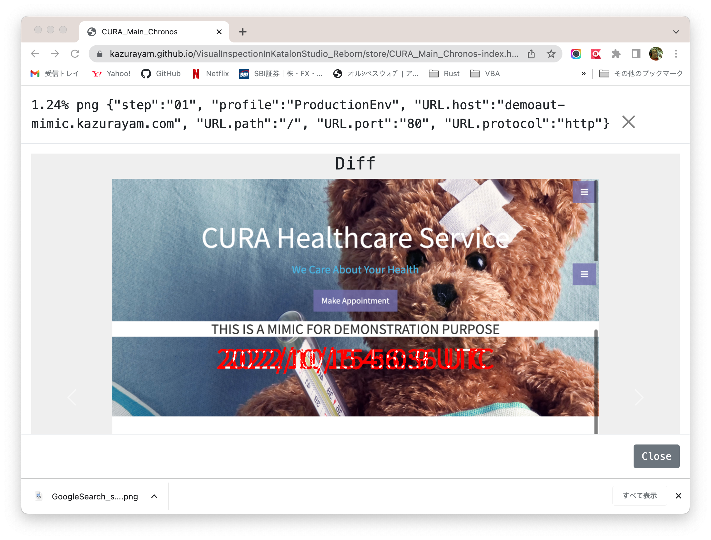
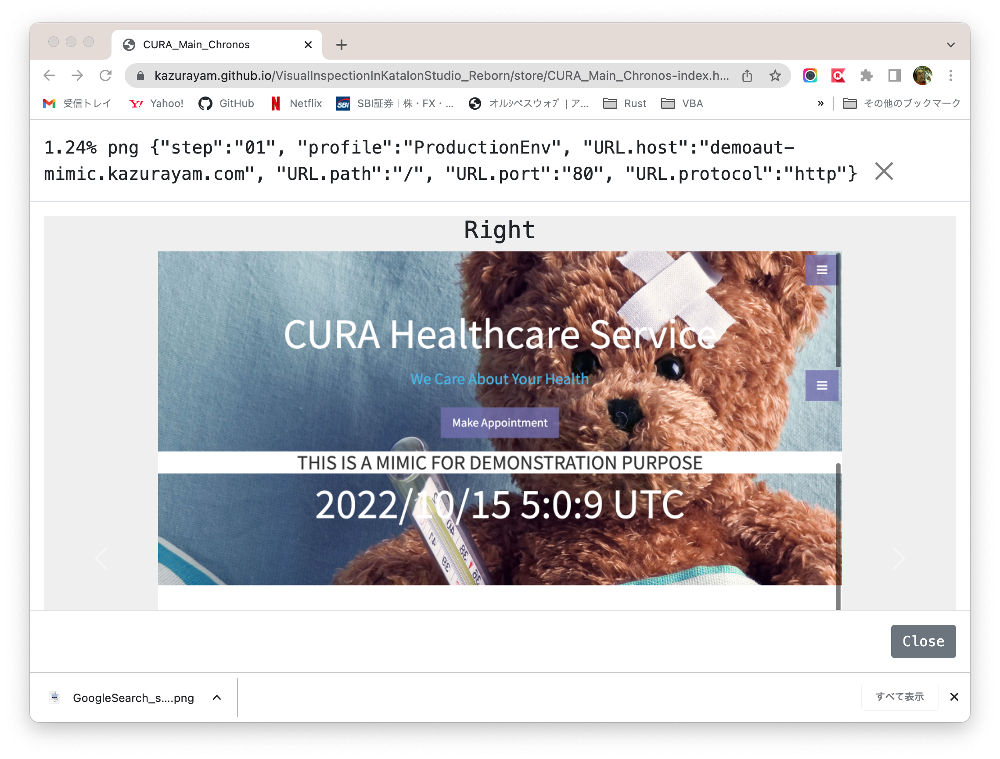

# Visual Inspection in Katalon Studio - Reborn

- @date Aug 2021
- @update April 2022
- @author kazurayam

<!-- START doctoc generated TOC please keep comment here to allow auto update -->
<!-- DON'T EDIT THIS SECTION, INSTEAD RE-RUN doctoc TO UPDATE -->
**Table of Contents**

- [My previous work](#my-previous-work)
- [My new development](#my-new-development)
  - [(1) Simpler codeset](#1-simpler-codeset)
  - [(2) Domain-specific file system indexed by metadata](#2-domain-specific-file-system-indexed-by-metadata)
  - [(3) Packaged in a jar](#3-packaged-in-a-jar)
  - [(4) Usable outside Katalon Studio](#4-usable-outside-katalon-studio)
- [Inspection, not Test](#inspection-not-test)
- [The documentation of "materialstore"](#the-documentation-of-materialstore)
- [Examples in Katalon Studio](#examples-in-katalon-studio)
  - [Creating a project, resolving external dependencies](#creating-a-project-resolving-external-dependencies)
  - [Target Web Application under Sample Tests](#target-web-application-under-sample-tests)
  - [External Dependencies](#external-dependencies)
- [Sample1: simply visit a URL and scrape](#sample1-simply-visit-a-url-and-scrape)
    - [(1) Test Case](#1-test-case)
    - [(2) The report generated](#2-the-report-generated)
    - [(3) The "store" directory structure](#3-the-store-directory-structure)
    - [(4) The objects/ directory](#4-the-objects-directory)
    - [(5) The index file](#5-the-index-file)
    - [(6) The metadata](#6-the-metadata)
- [Sample2: Visual Inspection in Chronos mode](#sample2-visual-inspection-in-chronos-mode)
    - [(1) Test Case](#1-test-case-1)
    - [(2) Execution Profile](#2-execution-profile)
    - [(3) The "store" directory](#3-the-store-directory)
    - [(4) making Chronological diff](#4-making-chronological-diff)
    - [(5) The report generated](#5-the-report-generated)
    - [(6) Interactively memorizing ignorable diffs](#6-interactively-memorizing-ignorable-diffs)
- [Sample3: Visual Inspection in Twins mode](#sample3-visual-inspection-in-twins-mode)
    - [(1) Test Case](#1-test-case-2)
    - [(2) Execution Profile](#2-execution-profile-1)
    - [(3) The "store" directory](#3-the-store-directory-1)
    - [(4) makiing diffs of Twins](#4-makiing-diffs-of-twins)
    - [(5) The report generated](#5-the-report-generated-1)
- [Sample4: Navigating multiple URLs in Twins mode](#sample4-navigating-multiple-urls-in-twins-mode)
    - [(1) What the test case does?](#1-what-the-test-case-does)
    - [(2) How to run the test](#2-how-to-run-the-test)
    - [(3) What is Flaskr?](#3-what-is-flaskr)
    - [(4) How the test is coded](#4-how-the-test-is-coded)
- [Setup Docker & Flaskr on your PC](#setup-docker--flaskr-on-your-pc)
  - [Installing Docker Desktop](#installing-docker-desktop)
  - [Command Line Interface](#command-line-interface)
  - [Starting up Flaskr](#starting-up-flaskr)
  - [Shutting down Flaskr gracefully](#shutting-down-flaskr-gracefully)
  - [Initializing Database in the web app](#initializing-database-in-the-web-app)
  - [How I used Docker](#how-i-used-docker)
- [Notes on Extensibility](#notes-on-extensibility)
  - [for Mobile](#for-mobile)
  - [for Web Service](#for-web-service)
- [Conclusion](#conclusion)
- [Appendix](#appendix)

<!-- END doctoc generated TOC please keep comment here to allow auto update -->

## My previous work

Sep 2018, I published a project named "Visual Testing in Katalon Studio" at

- https://github.com/kazurayam/VisualTestingInKatalonStudio

Please have a look at the "Motivation" section in its README document to know why I made it. I tried to implement what I called "Visual Testing" in Katalon Studio. The project worked for me.

But I wasn't satisfied with it. Why? I would enumerate 3 problems about that project.

1. The codeset of [Visual Testing In katalon Studio](https://github.com/kazurayam/VisualTestingInKatalonStudio) project is too complicated. The project contains 28 Test Cases, 7 Test Suites, 4 Test Suite Collections, 1 Test Listener, 12 Keywords. After 3 years, I forgot them and unable to maintain them any longer.
2. The project enables me to compare a pair of 2 screenshots of Web pages in PNG image format. That's all. Not enough. Often I wanted to compare 2 texts scraped from web. E.g, 2 HTML files as Web Page source; 2 JSON files downloaded from a Web Service.
3. The project isn't distributable to others easily because it isn't packaged. It's too hard for people to reuse the codeset of the project to achieve their own "Visual Testing" for their custom targets.

## My new development

In 2021 July-August, I have developed a new project named [`materialstore`](https://github.com/kazurayam/materialstore). It is a domain-specifc file system written in Groovy. In this project I have re-designed and re-implemented my idea from scratch. I have achieved the followings.

### (1) Simpler codeset

The `materialstore` provides a self-contained API in Groovy, which encapsulates all of the useful functionalities of the previous [Visual Testing In katalon Studio](https://github.com/kazurayam/VisualTestingInKatalonStudio) project. A single Test Case in Katalon Studio empowered by the `materialstore` library can achieve whole job equivalent to the previous one. No need to struggle with that many components (28 Test Cases + 7 Test Suites + 4 Test Suite Collections + 1 Test Listener + 12 Keywords).

### (2) Domain-specific file system indexed by metadata

By the word *material* I mean any type of files downloaded from Web applications during automated tests. Screenshot images (PNG), Web page source (HTML), JSON and XML responded by Web Services --- I call all of these as *materials*.

The `materialstore` provides capability of materializing (storing) files downloaded from web sites in a pre-designed directory structure (I call it the *store*).

An application writes files into the *"store"* associating *"metadata"*. The *"materials"* in the "store" are indexed by the associcated *metadata*. An application retrieves files from the store by *metadata* as key. An application does not look up files by name (Path). The application is no longer responsible for deciding and remembering the path of physical files.

 A *metadata* of a material in the store is merely an instance of `java.util.Map<String, String>` with arbitrary key=value pairs. You can programme any kind of *metadata* and associate it to each materials so that the materials are well described and clearly identified. For example, you can associate the URL from which the web resource was retrieved; or you can associate the name of browser ("Chrome", "FireFox", "Safari", etc) which you used to take the screenshots; or you can associate the name of "Execution Profile" in Katalon Studio which you applied when you executed your Test Case.

Metadata composition is entirely up to the user application. Composing metadata is a bit difficult part of the `materialstore` library. It looks similar to designing database table in SQL-backed application.

### (3) Packaged in a jar

The artifact of `materialstore` is distributed as a single jar file. The jar file is available at the [Maven Central Repository](https://mvnrepository.com/artifact/com.kazurayam/materialstore). Any Java/Groovy-based application can automate downloading the `materialstore-x.x.x.jar` to resolve dependency using the build tools (Gradle, Maven, Ant).

### (4) Usable outside Katalon Studio

The `materialstore`'s jar has no immediate dependency on the Katalon Studio API. It is not dependent even on the Selenium Webdriver API. So the `materialstore` library can be used in any Java/Groovy project, not only in Katalon Studio. I can use it in a plain [Selenium WebDriver](https://www.selenium.dev/documentation/webdriver/)-based automated test project for Web UI on Gradle. I can use it in a plain [Appium Java Client](https://github.com/appium/java-client)-based automated test project for Mobile UI on Maven. I can use it in a plain [Apache HttpClient](https://hc.apache.org/httpcomponents-client-5.1.x/)-based automated test project for Web Services on Ant.

## Inspection, not Test

I named my previous project as "Visual Testing". I think that this naming was not very good. To me, a word *testing* means to check if a system behaves as I expect. On the other hand, *inspection* means looking around a system for anything unexpected observed. This project does not really *test it*, but it does help me to *inspect it*.

Now I want to name my new project as **Visual Inspection**. I think it is a better naming.


## The documentation of "materialstore"

The following repository contains sample codes and documentation of the `materialstore` API. The sample codes are written in Java, run on Gradle + Selenium WebDriver + Apache HttpClient.

- [materialstore-examples](https://kazurayam.github.io/materialstore-examples/)


## Examples in Katalon Studio

Here I will present 3 examples which show how to use the `materialstore` library in Katalon Studio. I intend these will supersede my previous ["Visual Testing in Katalon Studio"](https://github.com/kazurayam/VisualTestingInKatalonStudio) project.

### Creating a project, resolving external dependencies

You can create a new Katalon Studio project, import the required external dependencies, and write your Test Cases for "Visual Inspection". Let me describe the procedure how to create your "Visual Inspection Reborn" project.

1. Install "Gradle" build tool into your PC. Please follow this [guide](https://gradle.org/install/) to install Gradle on your machine.

>You can use Gradle ver 7.x as well as ver 6.x.

2. Open Katalon Studio GUI. Create a new project as usual in whichever directory you like.

>I will write a symbol `$projectDir` to express this project directory.

3. create `$projectDir/build.gradle`. You should copy and paste the source of:

- [build.gradle](build.gradle)

4. In the commandline (outside Katalon Studio GUI) you want to execute the following command:

```
$ cd $projectDir
$ gradle drivers
```

5. The `gradle driver` will display some lines of messages in 10 seconds, and will finish successfully.

```
BUILD SUCCESSFUL in 1s
1 actionable task: 1 executed
```

6. Once the command finished, in the `$projectDir/Drivers` directory, you will find some jar files are automatically imported.

```
$ tree Drivers
Drivers
├── AUTOIMPORTED_ExecutionProfilesLoader-1.2.1.jar
├── AUTOIMPORTED_ashot-1.5.4.jar
├── AUTOIMPORTED_java-diff-utils-4.9.jar
├── AUTOIMPORTED_jsoup-1.13.1.jar
├── AUTOIMPORTED_materialstore-0.3.5.jar
└── AUTOIMPORTED_subprocessj-0.3.3.jar
```

>The exact version number of the jars may change in future. Please regard this as an example.


All of these jar files are downloaded from the [Maven Central Repositry](https://mvnrepository.com/). These are required to run the "Visual Testing" code in your new project in Katalon Studio locally.

>If you are going to push your new project into Git repository, you should write `.gitignore` file so that it ignores the `Drivers/` directory.

7. Stop Katalon Studio, restart it and re-open the project.

You have resolved external dependencies. Now you can start writing a Test Case.


### Target Web Application under Sample Tests

| sample name | Test Case | URL accessed 1st | URL accessed 2nd |
| :---------- | :-------------- | :--------------- | :--------------- |
| Sample1 Google | [GoogleSearch/ScrapeGoogleSearch](./Test%20Cases/main/GoogleSearch/ScrapeGoogleSearch.tc) | https://www.google.com/ |
| Sample2 CURA   | [CURA/VisualInspectionChronos](Test%20Cases/main/CURA/VisualInspectionChronos.tc) | http://demoaut-mimic.kazurayam.com/ | http://demoaut-mimic.kazurayam.com/ |
| Sample3 MyAdmin | [MyAdmin/VisualInspectionTwins](Scripts/main/MyAdmin/VisualInspectionTwins/Script1629114780778.groovy) | http://myadmin.kazurayam.com/ | http://devadmin.kazurayam.com/ |
| Sample4 Flaskr | [Flaskr/VisualInspectionTwins](Scripts/main/Flaskr/VisualInspectionTwins/Script1642595597544.groovy) | http://127.0.0.1:3080 | http://127.0.0.1:3090 | 

The **Sample1** opens the Google search page, makes search with keyword "katalon", takes screenshots, saves HTML sources.

As for the **Sample2**, the URL is provided by kazurayam.com (it's me!), publicly available on the Internet. The test visits a single URL twice with a few tempos of intermission.

As for the **Sample3**, both URLs are provided by kazurayam.com, publicly available on the Internet. The 2 pages have slight difference visually.

As for the **Sample4**, the 2 URLs are private ones on the localhost. The URLs are provided by a Docker container which runs on your PC. You need "Docker" installed on your PC to try the Sample4. The URL has multiple pages, requires fairly complex user interactions. In order to implement a automated UI test for this target, I employed the design pattern "Page Object Model" in Java.


### External Dependencies

The following table shows by which code these external dependencies are used

| External tools/libraries | the framework | Sample1 | Sample2 | Sample3 MyAdmin | Sample4 Flaskr |
| :--- | :--- | :--- | :--- | :--- | :--- |
| [ExecutionProfilesLoader](ExecutionProfilesLoader) | | |✔︎| ✔︎ |✔︎|
| [ashot](https://mvnrepository.com/artifact/ru.yandex.qatools.ashot/ashot) | |✔︎|✔︎|✔︎|✔︎|
| [java-diff-utils](https://mvnrepository.com/artifact/io.github.java-diff-utils/java-diff-utils) |✔︎|✔︎|✔︎|✔︎|✔︎|
| [jsoup](https://mvnrepository.com/artifact/org.jsoup/jsoup) |✔︎|✔︎|✔︎|✔︎|✔︎|
| [materialstore](https://mvnrepository.com/artifact/com.kazurayam/materialstore) |✔︎|✔︎|✔︎|✔︎|✔︎|
| [subprocess](https://mvnrepository.com/artifact/com.kazurayam/subprocessj) | | | | |✔︎|
| [Docker](https://www.docker.com/products/docker-desktop) | | | | |✔︎  |


## Sample1: simply visit a URL and scrape

First example. We will write a Test Case in Katalon Studio that visits the [Google Search page](https://www.google.com/). We will take screenshots and HTML page sources of the Web page. We will store PNG files and HTML files into the `store` directory using the `materialstore` library. We will finally generate a HTML file in which we can view the stored files.

#### (1) Test Case

You want to newly create a Test Case `Test Cases/main/GoogleSearch/scrapeGoogleSearch` in your project. Copy and paste the following sample source:

- [`Test Cases/main/GoogleSearch/searchGoogleSearch`](Scripts/main/GoogleSearch/scrapeGoogleSearch/Script1628518694544.groovy)

Once you have created the Test Case, you want to run it as usual by clicking the green button  in Katalon Studio GUI.

#### (2) The report generated

Once the Test Case finished, a HTML file will be created at `store/scrapeGoogleSearch.html`. Please open it in any web browser. It renders a view of the stored 6 files. You can see an working example here: [pls. click here](https://kazurayam.github.io/VisualInspectionInKatalonStudio_Reborn/store/scrapeGoogleSearch.html).


#### (3) The "store" directory structure

When the Test Case finished, you will find a new directory `$projectDir/store` is created. In there you will find a tree of directories and files, like this:

```
$ tree store
store
├── scrapeGoogleSearch
│   └── 20210813_221052
│       ├── index
│       └── objects
│           ├── 01014deef318115a75ac1c3ab0f9844832c81c86.html
│           ├── 02625f7607199d99ca58b803d6fe51b7c94835e7.html
│           ├── 2563a225cb7bcd438ae12a6126b2091eb8e09e7d.png
│           ├── 5c002fbe44438341d3d92832d1e004198153976b.png
│           ├── 8370ecd0081e1fb9ce8aaecb1618ee0fc16b6924.html
│           └── efaed8443417a62faf35ee9d9b858592cd67bbae.png
└── scrapeGoogleSearch.html
```

#### (4) The objects/ directory

- Under the `store/scrapeGoogleSearch/yyyyMMdd_hhmmss/objects/` directory, there are 6 files. Among them you will find 3 files with postfix `png`. These are the screenshot of web pages in PNG image format. Also you will find 3 files with postfix `html`. These are HTML sources of web pages.

- The file name comprises with 40 hex-decimal characters appended with extension (`.png`, `.html`). The hex-decimal string (I call this "ID") is derived from the file content without compression by [SHA1 Secure Hash algorithm](https://docs.oracle.com/javase/7/docs/api/java/security/MessageDigest.html).

#### (5) The index file

- The `store/scrapeGoogleSearch/yyyyMMdd_hhmmss/index` file would be interesting. An example of the `index` file is like [this](docs/store/scrapeGoogleSearch/20210813_221052/index):

```
8370ecd0081e1fb9ce8aaecb1618ee0fc16b6924	html	{"URL.host":"www.google.com", "URL.path":"/", "URL.protocol":"https"}
2563a225cb7bcd438ae12a6126b2091eb8e09e7d	png	{"URL.host":"www.google.com", "URL.path":"/", "URL.protocol":"https"}
...
```

The `index` file is a plain text file. Each lines corresponds to each files stored in the `objects` directory.

A line of the `index` file has 3 parts delimited by TAB characters.

```
<SHA1 Hash value of each file>\t<file type>\t<metadata>
```

#### (6) The metadata

In the test Case script, the code created  *metadata* for each objects. Typically a metadata will include information derived from the URL of the source Web Page. For example, an URL

- `http://www.google.com/`

will be digested to form a metadata 

- `{"URL.host":"www.google.com", "URL.path":"/", "URL.protocol":"https"}`

Plus, you can add any key-value pair into the metadata as you like.

In the `index` file, lines are sorted by the ascending order of *metadata* text.

The `materialstore` API restricts that *metadata* texts in a `index` file MUST be unique. Your application can not create multiple objects (= multiple lines in the `index` file) with the same *metadata* value.


## Sample2: Visual Inspection in Chronos mode

Second example. We will write a Test Case in Katalon Studio that visits the [http://demoaut-mimic.kazurayam.com/](http://demoaut-mimic.kazurayam.com/). The top page displays a current timestamp in the unit of seconds. So everytime you retrieve this page, the page changes slightly at the timestamp portion.

*How is the current page of a web system different from what it was previously since 5 minutes ago, 3 hours ago, or 2 days ago? I want to see the differences in HTML code, not only visually as screenshots comparison.* --- the second example will show you how to implement a test that helps.

#### (1) Test Case

In your project, you want to copy&paste the following Test Case code.

- [`Test Cases/main/CURA/VisualInspectionChronos`](Scripts/main/CURA/VisualInspectionChronos/Script1629114744842.groovy)

You will execute the Test Case two times. You run it once; wait for some period (seconds, minuits, hours, or days, ... up to you); then run it again. The Test Case will preserve the output of previous runs.

#### (2) Execution Profile

This Test Case expects an Execution Profile is provided like this:

- `Profiles/CURA_DevelopmentEnv`


Please create it in your project.


#### (3) The "store" directory

You will get 2 directories named in the format of  `yyyyMMdd_hhmmss`. The directories will look like this:

```
$ tree store
store
├── CURA_VisualInspectionChronos
│   ├── 20210814_143440
│   │   ├── index
│   │   └── objects
│   │       ├── 081a2a3e3174f13f60a9707f9464d1d73339d0e3.html
│   │       ├── 4d671f2cd14839164840a520cb185c2d1bb68586.png
│   │       ├── 504259db4e6562f62f8f70a6991fbce42aa55407.html
│   │       ├── 668b2a28455d9524fc1da35317f44d3797ea5344.html
│   │       ├── 6b82ac13ae98ca3c055d28469b75c8f377c1d8b1.png
│   │       ├── 6b8a699d921520c10b9e7e61cf62e528bf263fa8.html
│   │       ├── 8dd629a5d1b542b80bebc571c1ee35d27157ea1e.html
│   │       ├── a11357d7fbc475f7fefabd50f468b9b4fd4e8b35.png
│   │       ├── ed401b9bff2a687e41cedd9a63b3dd15880964eb.png
│   │       └── f8664dfa1c3a3af60914c4c90ddfaf0286910133.html
│   └── 20210814_143722
│       ├── index
│       └── objects
│           ├── 01746787bffa40e2ae0997da12e66c3f6ed50a87.png
│           ├── 25e752bc500be3a94fad9a4e6fc3ebc25431b558.png
│           ├── 3d56d836f5c778d0ec31f72fd74fcc5d3cb348fd.html
│           ├── 4d671f2cd14839164840a520cb185c2d1bb68586.png
│           ├── 582791931452081590447c71d8769ae185ff7cb9.html
│           ├── 668b2a28455d9524fc1da35317f44d3797ea5344.html
│           ├── 6b82ac13ae98ca3c055d28469b75c8f377c1d8b1.png
│           ├── e18882a39ba9632e9b0018e642d90a289fd1bcb7.html
│           ├── f6b51712f25ba02a5b39eedb30a57b31d455eafc.html
│           └── f8664dfa1c3a3af60914c4c90ddfaf0286910133.html
└── CURA_VisualInspectionChronos-index.html
```

#### (4) making Chronological diff

The Test Case compares takes materials at chronologically different timings, and then compare the 2 sets.

`Test Cases/CURA/VisualInspectionChronos` does the followng processing:

1. make a List of materials in the current timestmp directory
2. make another List of materials in the previous timestamp directory
3. make differences between the two lists, store the diff info into the store as well
4. generate a HTML report, where you can view the detail with diff information.

#### (5) The report generated

Once the Test Case finished, a HTML file will be generated at `store/CURA_VisualInspectionChronos-index.html`. Please open it in any web browser. It renders a view of the stored 6 files. You can see an working example here: [pls. click here](https://kazurayam.github.io/VisualInspectionInKatalonStudio_Reborn/store/CURA_VisualInspectionChronos-index.html).

You can see examples of screenshot comparison result: Previous screenshot - diff image - current screenshot.






Also you can see examples of HTML page sources comparison result.


#### (6) Interactively memorizing ignorable diffs

You can interact with the report generated by the Visual Inspection. See the top-left corner of the report. You will find the count of "diff" entities are displayed.


- `2w 0i 6t`

This means:

- There are 2 diff entities that have a diff-ratio greater than the criteria given.
- There are 0 diff entities that have a diff-ratio greater than the criteria given, and is "checked to be ignorable"
- There are 6 diff entities in total.

In other words, I created 6 materials (PNG screenshot and HTML source saved). I set `1.0%` as the criteria of evaluating the diffRatio; if an entity has a diffRatio greather than 1.0, it will be marked *warning*, hence the figure `46.66%` is highlighted with the background color of yellow.

A large diffRatio indicates to me that there must be some reason that caused significant visual differences; therefore I should look into the system. Definitely I will do for every entities warned. I would find some reason why the diffRatio is as large as `46.66%`. No matter what the reason is, I would decide whether the entity is **ignorable** or not.

In fact in most cases, the diffs detected by automated tests are ignorable for human. For example, when I compare the development environment against the production environment of a Web app, it is quite likely that there are some significant visual differences caused by the recent changes in the application software in the development environment. Any visual differences caused by known factors are **ignorable** for human, and I want to differentiate them from the diffs caused by unexpected factors. 

Only human can decide if a visual difference is ignorable or not; my Visual Inspection tool does not decide it. But *the tool offers you a feature of persisting your decision into the report and memorize it across sessions.* Let me assume I have found out that the entity with 46.33% in the following screenshot is ignorable. Then I would interact with the report displayed in a browser. I will click the checkbox at the left end of the entity.


When the checkbox is checked, the diffRatio `43.66%` changes its background color less highlighted. And the "Count" display on the top-left corner changes:

- `2w 0i 6t` => `1w 1i 6t`

This display indicates that I have 1 warning, 1 ignorable, among 6 entities in total.

I will continue debugging. I will look at the entity with the diffRatio `1.87%`. Let me assume I found it *ignorable* again. Then I will check it also. Eventually the report would give the following display:


Now I have got

- `0w 2i 6t`

*I have zero warnings! Congrat! I have finished inspecting this web application!*

The checkbox status toggled ON/OFF by human is persisted into [localStorage](https://developer.mozilla.org/en-US/docs/Web/API/Window/localStorage) of browser. Therefore your decisions (which entities to be ignored) will be retained across browser sessions. You can reload the report, close and reopen the report. The checkboxes in the report will keep the status you put previously.


## Sample3: Visual Inspection in Twins mode

The 3rd example visits 2 URLs. These are useless pages solely for this example.

- [http://mydmin.kazurayam.com/](http://myadmin.kazurayam.com/)
- [http://devadmin.kazurayam.com/](http://devadmin.kazurayam.com/)

The former URL is meant to represent a *Production environment* of a web system, the latter URL is meant to represent a *Development environment*. The pages look similar at a glance, but are different in detail.

*How the pages of 2 environments differ now?* --- the 3rd example will show you.

#### (1) Test Case

In your project, you want to copy the followiing Test Case code.

- [`Test Cases/main/MyAdmin/VisualInspectionTwins`](Scripts/main/MyAdmin/VisualInspectionTwins/Script1629114780778.groovy)

You will execute the Test Case only once. The Test Case will visit the 2 URLs as one batch. And it creates a HTML report.

#### (2) Execution Profile

The Test Case script expects 2 Execution Profiles are provided like this:

- `Profiles/MyAdmin_DevelopmentEnv`


- `Profiles/MyAdmin_ProductionEnv`


Please create them in your project.

#### (3) The "store" directory

Once finished, the Test Case creates a directory named in the format of `yyyyMMdd_hhmmss`. The directory looks like this:

```
$ tree store
store
├── MyAdmin_VisualInspectionTwins
│   └── 20210814_224127
│       ├── index
│       └── objects
│           ├── 2cf3afe9ff4104e4055f0dc2bff53b9166e80a0c.html
│           ├── 4cbd1ac3812a5251325202f86a8dfe76bc82dbdc.png
│           ├── 5e3ff331ef4ff3feb3222f0d2951aed284e47ac2.png
│           ├── adb4c03ac0f0928a4dff3328845c4db460fc72b5.html
│           ├── b0456c0ae964825a1508b28ac1042340b29c9357.html
│           └── e911ce587553fc42f24bf18279ee3f5214eb75ba.png
└── MyAdmin_VisualInspectionTwins-index.html
```


#### (4) makiing diffs of Twins

The Test Case looks up 2 set of materials and compare them.

`Test Cases/main/MyAdmin/VisualInspectionTwins` does the following processing:

1. Amongst the stored materials, select 2 (a screenshot and a HTML) of the *Development environment* to make a List.
2. Also select 2 of the *Projection environment* to make a Liist.
3. do take differences between the two lists. 
4. will insert files into the "store", which contains the diff information.
5. generate a HTML report, where you can view the detail with diff information.

----

How can I select materials amongst many appropriately and make pairs to compare?

Well, it is difficult to explain. I wonder if I could describe it in English, but let me try.

In the `objects` directory, there are 6 files. These are a mixture of materials downloaded from 2 URLs. How can I tell which file is from which URL? --- The `index` file keeps enough information. The content of `index` file is as follows:

- [store/MyAdmin_VisualInspectionTwins/20210814_224127/index](docs/store/MyAdmin_VisualInspectionTwins/20210814_224127/index)

In there you can find the following 2 lines. These lines point to the PNG screenshots of the 2 environments. I call the 3 column delimited by \t (`{"URL.host": ... :"body"}`) as *metadata*.

```
...
5e3ff331ef4ff3feb3222f0d2951aed284e47ac2	png	{"URL.host":"devadmin.kazurayam.com", "URL.path":"/", "URL.protocol":"http", "profile":"MyAdmin_DevelopmentEnv", "selector":"body"}
...
4cbd1ac3812a5251325202f86a8dfe76bc82dbdc	png	{"URL.host":"myadmin.kazurayam.com", "URL.path":"/", "URL.protocol":"http", "profile":"MyAdmin_ProductionEnv", "selector":"body"}
...
```

These 2 lines have a common portion in the *metadata*:

```
{"URL.path":"/", "selector":"body"}
```

Also they have a different portion:

```
{{"URL.host":"devadmin.kazurayam.com", "profile":"MyAdmin_DevelopmentEnv"}
{{"URL.host":"myadmin.kazurayam.com", "profile":"MyAdmin_ProductionEnv"}
```

The Test Case script can select 2 lines as a pair amongst others by looking at their *metadata*. I would ignore the known different portions in the *metadata* resulting a common portion. Taking the common portion as a key of lookup, I could find a pair or materials to compare.

Difficult to understand? Well, I agree. But this is the best flexible and expressive method I could develop.

#### (5) The report generated

Finally the Test Case will generate a HTML report of which path is `store/MyAdmin_VisualInspectionTwins-index.html`. Please open it in any web browser. It renders a view of the stored 1 page, both in PNG screenshot and HTML page source. You can see an working example here: [pls.click here](https://kazurayam.github.io/VisualInspectionInKatalonStudio_Reborn/store/MyAdmin_VisualInspectionTwins-index.html)

You can see a screenshot comparison result: Production Env - Diff - Development Env.


Also you can see the diff of HTML page source.


## Sample4: Navigating multiple URLs in Twins mode

The sample3 showed how to compare just a single pair of URLs. The next sample4 shows how to compare multiple pairs of URLs. The sample4 shows how to navigate though a site for 7 pages while taking screenshots and HTML sources.

#### (1) What the test case does?

The test case [Flaskr/VisualInspectionTwins](Scripts/main/Flaskr/VisualInspectionTwins/Script1642595597544.groovy) does the following:

1. It compares 2 web sites visually: `http://127.0.0.1` and `http://127.0.0.1:3090`. 
- (You can setup these URLs on your PC locally. I will explain how to later in this document.)
2. A web application named **Flakr** run in the URLs. Let me call them "Flaskr *Prod env*" and "Flaskr *Dev env*". These 2 URLs have just the same functionality. But the pages look slightly different. The production environment has no site logo, but the development environment has a small site logo. .
- the Prod env

- the Dev env


3. The test case starts visiting the index page, then navigates through pages by clicking menu anchors, typing texts, clicking buttons, etc.

| Step | description          | Prod env URL      | Dev env URL |
|:-----|:---------------------|:------------------|:------------|
|step1 | index page           | http&#58;//127.0.0.1/ | http&#58;//127.0.0.1:3090/ |
|step2 | register credential  | http&#58;//127.0.0.1/auth/register | http&#58;//127.0.0.1:3090/auth/register |
|step3 | log in               | http&#58;//127.0.0.1/auth/login | http&#58;//127.0.0.1:3090/auth/login |
|step4 | posting - blank      | http&#58;//127.0.0.1/create | http&#58;//127.0.0.1:3090/create |
|step5 | posting - text typed | http&#58;//127.0.0.1/create | http&#58;//127.0.0.1:3090/create |
|step6 | list of blogs        | http&#58;//127.0.0.1/ | http&#58;//127.0.0.1:3090/ |
|step7 | log out              | http&#58;//127.0.0.1/ | http&#58;//127.0.0.1:3090/ |

4. The test case compares each pairs of URLs and generates diff images. The following is an example of a diff image. Please find the section on the top-left side <span style="color:red;">painted red</span>, which is the diff. 

5. The test case generates a HTML report which shows a list all of the materials (screenshot images and HTML page sources) attached with detail diff information. You can find an example [here](https://kazurayam.github.io/VisualInspectionInKatalonStudio_Reborn/store/Flaskr_VisualInspectionTwins-index.html).


#### (2) How to run the test

Just open the "Test Cases/Flaskr/VisualInspectionTwins" and run it. As default Chrome Headless browser git will be used, but you can choose any browser. You can choose any Execution Profile. The test won't be affected by the profile you chose.

The test case will take approximately 30 seconds to finish.

The test case will write the report in the `<projectDir>/store/Flaskr_VisualInspectionTwins-index.html` file.

#### (3) What is Flaskr?

Flaskr is coded in Python language on top of the "Flask" web application framework. I learned the Flaskr web app at the [Flask Tutorial](https://flask.palletsprojects.com/en/2.0.x/tutorial/) authored and published by the Pallets project.

>This tutorial will walk you through creating a basic blog application called Flaskr. Users will be able to register, log in, create posts, and edit or delete their own posts. 

I used the source code 99% as is. I amended it slightly to diplay the site logo in the Dev env only.

#### (4) How the test is coded

You can read the sources
- [Test Cases/Flaskr/VisualInspectionTwins](Scripts/main/Flaskr/VisualInspectionTwins/Script1642595597544.groovy)
- [Test Cases/Flaskr/navigate_through_the_site](Scripts/main/Flaskr/navigate_through_the_site/Script1642812095057.groovy)

and a lot of related Groovy classes

- [Keywords/flaskrtest/actions/LoginAction.groovy](Keywords/flaskrtest/actions/LoginAction.groovy)
- [Keywords/flaskrtest/actions/LogoutAction.groovy](Keywords/flaskrtest/actions/LogoutAction.groovy)
- [Keywords/flaskrtest/actions/PostAction.groovy](Keywords/flaskrtest/actions/PostAction.groovy)
- [Keywords/flaskrtest/data/Song.groovy](Keywords/flaskrtest/data/Song.groovy)
- [Keywords/flaskrtest/data/Songs.groovy](Keywords/flaskrtest/data/Songs.groovy)
- [Keywords/flaskrtest/data/User.groovy](Keywords/flaskrtest/data/User.groovy)
- [Keywords/flaskrtest/pages/auth/LoginPage.groovy](Keywords/flaskrtest/pages/auth/LogInPage.groovy)
- [Keywords/flaskrtest/pages/auth/RegisterCredentialPage.groovy](Keywords/flaskrtest/pages/auth/RegisterCredentialPage.groovy)
- [Keywords/flaskrtest/pages/blog/CreatePostPage.groovy](Keywords/flaskrtest/pages/blog/CreatePostPage.groovy)
- [Keywords/flaskrtest/pages/blog/IndexPage.groovy](Keywords/flaskrtest/pages/blog/IndexPage.groovy)
- [Keywords/flaskrtest/pages/blog/Post.groovy](Keywords/flaskrtest/pages/blog/Post.groovy)

Why do I have these Groovy classes? --- It is because I employed the ["Page Object Model"](https://www.guru99.com/page-object-model-pom-page-factory-in-selenium-ultimate-guide.html). The Page Object Model helped me in writing compact and readable codes.

The sample4 is highly extensible while avoiding code publications. It would be a foundation of large scale Visual Inspection projects.


## Setup Docker & Flaskr on your PC

In the sample4, we need 2 URLs available on our own PC.

- http://127.0.0.1/
- http://127.0.0.1:3090 

You can make it work on your PC. You need [Docker](https://www.docker.com/) installed into your PC.

### Installing Docker Desktop

On my MacBook Air, I installed [Docker Desktop](https://www.docker.com/products/docker-desktop). Docker Desktop for Windows is also available.

### Command Line Interface

Here I assume you work on a Command Line Interface. I use the Terminal.app of macOS. For Windows user, install [Git for Windows](https://gitforwindows.org/) which bundles "Git Bash".

### Starting up Flaskr

Open a window of Command Line Interface, then execute:

```
$ cd $VisualInspectionInKatalonStudio_Reborn
$ ./startup-flaskr-prod.sh
```

This shell script will emit 2 lines of messages and will block:
```
you can visit http://127.0.0.1/
Serving on http://0.0.0.0:8080
```

Next, you want to open one more window of Command Line Interface, then execute:

```
$ cd $VisualInspectionInKatalonStudio_Reborn
$ ./startup-flaskr-dev.sh
```

This will emit 2 lines of messages and will block:

```
$ ./startup-flaskr-dev.sh
you can visit http://127.0.0.1:3090/
Serving on http://0.0.0.0:8080
```

By `lsof` command, you can make sure that 2 processes are listening to the IP port #80 and #3090 on your localhost.

```
$  lsof -i -P | grep LISTEN | grep com.docke
com.docke   709 kazuakiurayama  107u  IPv6 0x84f53716e8d7cb33      0t0  TCP *:3090 (LISTEN)
com.docke   709 kazuakiurayama  111u  IPv6 0x84f53716e8d771d3      0t0  TCP *:80 (LISTEN)
```

### Shutting down Flaskr gracefully

You can stop the docker process gracefully by typing CTRL + C.

You should NEVER close the window of Command Line Interface without stopping the docker process by CTLR + C.

If you forced to close the window, then IP Port #80 and #3090 might be left *USED* status. In that case you would fail to start a new process of Flaskr again. When it occurred, you need to stop & restart your PC/OS to release the ports.


### Initializing Database in the web app

The Flaskr has a backend database where credentials and blog posts are stored. After you repeated running tests several times you will find many blog posts are stored, and you would feel like to clean the database out.

Just type CTRL + C to stop the docker process and restart it. The start-up script will automatically initialize the Flaskr's internal database and make it empty.

### How I used Docker

Hava a look at the code of [startup-flaskr-prod.sh](startup-flaskr-prod.sh):

```
CWD=$(pwd)
cd $(mktemp -d)

echo you can visit http://127.0.0.1/

docker run -it -p 80:8080 kazurayam/flaskr-kazurayam:1.1.0

cd $CWD
```

As you see, it runs `docker run` command with a docker image `kazurayam/flaskr-kazurayam:1.1.0`. I created this docker image and published at the [Docker Hub](https://hub.docker.com/repository/docker/kazurayam/flaskr-kazurayam).


## Notes on Extensibility

The `materialstore` library is usable for various cases. Once the materials are saved into the store, same diff + reporting features work.

### for Mobile

The `materialstore` library can be used by a [Appium](https://appium.io/)-based Mobile testing in Java. All you need to do is to take screenshots of Mobile app using Katalon Studio's built-in keyword (e.g, [Mobile taksScreenshot](https://docs.katalon.com/katalon-studio/docs/mobile-take-screenshot.html)) and save the image into the `store`.

### for Web Service

The `materialstore` library can be used by a [Apache HttpClient](https://hc.apache.org/httpcomponents-client-5.1.x/)-based Web Service testing in Java. Using Katalon Studio's [sendRequest](https://docs.katalon.com/katalon-studio/docs/ws-send-request.html) keyword, you can get a response. Then your script extract the response body (JSON, XML) and save them into the `store`.

## Conclusion

The [Visual Testing In Katalon Studio](https://github.com/kazurayam/VisualTestingInKatalonStudio) project is now superseded by this [Visual Inspection In Katalon Studio - Reborn](https://github.com/kazurayam/VisualInspectionInKatalonStudio_Reborn) project backed by the [materialstore](https://github.com/kazurayam/materialstore) library.


## Appendix

- [materialstore API javadoc](https://kazurayam.github.io/materialstore/api/)
- [materialstore-mapper API javadoc](https://kazurayam.github.io/materialstore-mapper/api/)

